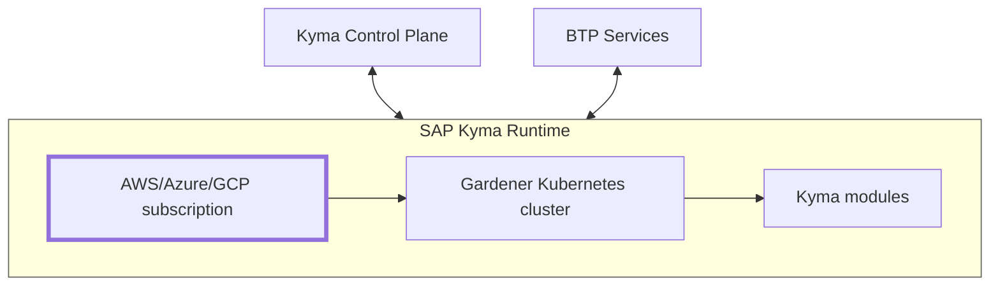

# XP264- Explore how to run cloud-native applications on SAP BTP, Kyma runtime

## Description

This repository contains the material for the SAP TechEd 2025 session catalog number XP264 - [**Explore how to run cloud-native applications on SAP BTP, Kyma runtime.**](https://url.sap/xuntr9)  

  * Day-2 Operations: Management, Maintenance, Monitoring, and Optimization
  * Technical connectivity to public and private (on-premise) systems 

## Overview

This session introduces attendees to **Day-2** operations with SAP BTP, Kyma runtime - a managed kubernetes environment to help connect and extend enterprise applications in the cloud-native world.  

<table style="width: 100%; border-collapse: collapse; background-color: #f5f5f5;" border="1">
<tbody>
<tr style="height: 193px;">
<td style="width: 71.6%; height: 193px;">
<div>

In a nutshell, SAP BTP, Kyma Runtime (SKR) is a managed runtime environment with a kubernetes cluster based on Gardener and a set of building blocks called Kyma modules.  

As a result, each instance of SAP BTP Kyma runtime environment is a single k8s gardener cluster with its own set of kyma modules.  

All these kubernetes clusters are managed by a central Kyma Control Plane (KCP) that orchestrates the lifecycle of 
 - the underlying hyperscaler (AWS/Azure/GCP) subscription (project), 
 - the Gardener Cluster, 
 - and the Kyma modules.
<hr>



</div>
</td>
</tr>
</tbody>
</table> 


### During the session you will learn...

  * how to operate applications with SAP BTP, Kyma runtime and discover the power of smooth integration with cloud applications and on-premise systems using the advanced connectivity features.  
  * to explore operational best practices from mastering troubleshooting techniques and intelligent root-cause analysis to event-driven autoscaling that adapts to your business needs in real time.
  * about BTP multitenant applications with SAP BTP, Kyma runtime.

## Requirements

The requirements to follow the exercises in this repository are...

> [!IMPORTANT]
> You must be able to fork the repository and activate the github actions at the fork. This is mandatory for this session!  
> Thus, you may need a GitHub user.  
> If you haven't got one yet, please [sign-up](exercises/ex0#exercise-00---sign-up-for-a-new-github-account) on GitHub before the workshop or at the very beginning of the session.

> [!IMPORTANT]
> The session content is provided *exclusively* on the SAP-Samples github, and many excercises have been implemented as CI/CD [Github Actions worflows](https://docs.github.com/en/actions/get-started/understand-github-actions) (GHA). 

> [!IMPORTANT]
> The security is paramount!  
> With the Github Action IDP-delegated authentication flow, there is no more need to provide kubernetes and btp credentials when using the [github actions](https://docs.github.com/en/actions/concepts/security/openid-connect#benefits-of-using-oidc). 
>  - ✅ The Github Action workflows acting as the [OIDC provider](https://docs.github.com/en/actions/concepts/security/openid-connect). 
>  - ✅ All the kubernetets environments in the landscape are configured to trust GitHub’s token identity provider. They come with the pre-configured OIDC applications leveraging the built-in Gardener OIDC shoot extension.
>  - ✅ SAP Cloud Identity Services acting as a platform IDP on the BTP side of the house has been federated with the Github actions OIDC Provider
>  - ✅ As a result, the very short-lived [credentials](https://docs.github.com/en/actions/concepts/security/openid-connect#understanding-the-oidc-token) are being fetched and rotated automatically on the behalf of the repository user for both kubernetes and btp platform operations.

> [!WARNING]
> Personal devices ought not to be used for this session.
>
> - However, the good news is you may run the **GHA-based exercises** directly, from your [forked repository](
https://url.sap/h4ioc0), in the Chrome browser on the **provided** teched laptops.

> [!TIP]
> **Session directions.**  
>
> The session is pretty packed with content and information.  To make the best use of your time you may want to follow the below tips.  
> - 👉 Run and take time to inspect the results of the built-in automations. Ask questions. And if you feel like doing, go ahead and create your own variants as well.
> - 👉 The recommendation is, however, to go with the mere flow of the exercises and leave the rest for homework.
>
> - For any exercise which may require a terminal use, you may use the VSCode integrated terminal.

> [!NOTE]
> - As this is the Day-2 operation brief, the entire cloud landscape has been pre-configured with a number of shared components, namely:  
>   - 🔗 SAP Cloud Identity Services (SAP IAS)  
>   - 🔗 SAP Cloud Logging  
>   - 🔗 SAP HANA Cloud  
>   - 🔗 ArgoCDaaS  
>   - 🔗 SAP BTP Connectivity services - Destination service, Connectivity service, Cloud Connector, Connectivity Proxy and Transparent Proxy  
>   - 🔗 S4/HANA On-premise (private cloud) with the Cloud Connector in the private network.  
>
> - All of the SAP Kyma environments have been configured to the same template (via terraform automation).  
>
> - Last but not least, you will be able to *play* with a SAP Build multi-tenant application pre-deployed to one of the kyma provider clusters.   

- :notebook: FYI: There are several additional command line tools available on your SAP TECHED 2025 Client laptops, namely:  
    
  - kubectl plugin list
    ```
    The following compatible plugins are available:

    C:\Software\CLI\Kubernetes\kubectl-convert.exe
    C:\Users\TE-06\.krew\bin\kubectl-krew.exe
    C:\Users\TE-06\.krew\bin\kubectl-oidc_login.exe
    C:\Users\TE-06\.krew\bin\kubectl-resource_capacity.exe
    C:\Users\TE-06\.krew\bin\kubectl-view_serviceaccount_kubeconfig.exe 
    ``` 
  - jq, curl, [kyma cli](https://url.sap/ottdcc), terraform, etc.


## [Let's get started...](exercises/ex0/)

* #### [Exercise 0 - Preparation Steps](exercises/ex0#exercise-0---preparation-steps)

  * [Exercise 0.0 - Sign up for a GitHub account](exercises/ex0#exercise-00---sign-up-for-a-new-github-account)
  * [Exercise 0.1 - Fork the teched2025-XP264 repository](exercises/ex0#exercise-01---fork-the-teched2025-xp264-repository)
  * [Exercise 0.2 - Let the session begin!](exercises/ex0#exercise-02---the-rules-of-the-game)
  * [Exercise 0.3 - BTP landscape at a glance (optional)](exercises/ex0#exercise-03---btp-landscape-at-a-glance)
  * [Exercise 0.4 - Let's talk SAP BTP, Kyma Runtime architecture (optional)](exercises/ex0#exercise-04---sap-btp-kyma-runtime-skr-architecture)
 
* #### [Exercise 1 - First things first. Day-2 with SAP Kyma managed kubernetes runtime](exercises/ex1#exercise-1---first-things-first-day-2-with-sap-btp-kyma-runtime)

  * [Exercise 1.1 - Easy access to your session landscape (with SSO).](exercises/ex1#exercise-11---easy-access-to-your-teched-landscape-with-sso)
  * [Exercise 1.2 - Built-in github automation flows](exercises/ex1#exercise-12---built-in-github-actions-automation-flows)
  * [Exercise 1.3 - Zoom on Kyma CLI (optional)](exercises/ex1#exercise-13---zoom-on-kyma-cli-optional)
  * [Exercise 1.4 - Firefighter access](exercises/ex1#exercise-14---fire-fighter-access-to-your-kyma-cluster)
  * [Exercise 1.5 - Terraforming kyma runtime environment](exercises/ex1#exercise-15---terraforming-kyma-runtime-environment)
  * [Exercise 1.6 - Multitenancy playground](exercises/ex1#exercise-16---subscribe-to-a-kyma-multitenant-application)


* #### [Exercise 2 - Using External Scalers. Keda - the Kubernetes Event-driven Autoscaler.](exercises/ex2#exercise-2---use-external-scalers-keda---the-kubernetes-event-driven-autoscaler)
  * [Exercise 2.0 - Introduction to kubernetes autoscalers](exercises/ex2#exercise-20---introduction-to-kubernetes-autoscalers)
  * [Exercise 2.1 - HPA - Horizontal Pod Autoscaler](exercises/ex2#exercise-21---hpa)
  * [Exercise 2.2 - KEDA - Kubernetes Event-driven Autoscaler](exercises/ex2#exercise-22---keda)
  * [Exercise 2.3 - KEDA - Cron based scaler](exercises/ex2#exercise-23---kedas-cron-based-scaler)


* #### [Exercise 3 - Explore Kyma Telemetry Features with SAP Cloud Logging](exercises/ex3#exercise-3---exploring-kyma-telemetry-with-sap-cloud-logging)

  * [Exercise 3.0 - Simulate some load](exercises/ex3#exercise-30---simulate-some-load)
  * [Exercise 3.1 - Access SAP Cloud Logging](exercises/ex3#exercise-31---access-sap-cloud-logging)
  * [Exercise 3.2 - Explore Logs](exercises/ex3#exercise-32---explore-logs)
  * [Exercise 3.3 - Explore Metrics](exercises/ex3#exercise-33---explore-metrics)
  * [Exercise 3.4 - Explore Traces](exercises/ex3#exercise-34---explore-traces)


* #### [Exercise T1 - Enable Transparent Proxy Kyma Module (optional)](exercises/exT1#exercise-t1---enable-transparent-proxy-kyma-module)

  * [Exercise T1.1 - Navigate To The Kyma Dashboard](exercises/exT1#exercise-t11-navigate-to-the-kyma-dashboard)
  * [Exercise T1.2 - Enable Transparent Proxy Module](exercises/exT1#exercise-t12-enable-transparent-proxy-module)
  * [Exercise T1.3 - Explore What Changed In The Kyma Instance](exercises/exT1#exercise-t12-explore-what-changed-in-the-kyma-instance)


* #### [Exercise T2 - Configure Transparent Proxy Kyma Module](exercises/exT2#exercise-t2---configure-transparent-proxy-kyma-module)

  * [Exercise T2.1 - Navigate to your working Namespace in Kyma Dashboard](exercises/exT2#exercise-t21-navigate-to-your-working-namespace-in-kyma-dashboard)
  * [Exercise T2.2 - Create a dynamic Destination Custom Resource](exercises/exT2#exercise-t22-create-a-dynamic-destination-custom-resource)
  * [Exercise T2.3 - Create a static Destination Custom Resource](exercises/exT2#exercise-t23-create-a-static-destination-custom-resource)
  * [Exercise T2.4 - Explore the results of the creation of the Destination CRs via Kubectl](exercises/exT2#exercise-t24-explore-the-results-of-the-creation-of-the-destination-crs-via-kubectl)

* #### [Exercise T3 - Use Transparent Proxy Kyma Module](exercises/exT3#exercise-t3---use-transparent-proxy-kyma-module)

  * [Exercise T3.1 - Run a cURL Pod Included in the Istio Service Mesh](exercises/exT3#exercise-t31-run-a-curl-pod-included-in-the-istio-service-mesh)
  * [Exercise T3.2 -  Connect to remote systems defined as destinations using the dynamic "gateway" Destination CR](exercises/exT3#exercise-t32-connect-to-remote-systems-defined-as-destinations-using-the-dynamic-gateway-destination-cr)
  * [Exercise T3.3 - Connect to a remote system defined as destination using the dedicated (static) "s4any" Destination CR](exercises/exT3#exercise-t33-connect-to-a-remote-system-defined-as-destination-using-the-dedicated-static-s4any-destination-cr)


----------------------------  

## Additional resources

SAP Kyma in Developers Tutorial Navigator: [here](https://developers.sap.com/tutorial-navigator.html?search=kyma).  
SAP Kyma runtime samples: [here](https://github.com/SAP-samples/kyma-runtime-samples)  

## Contributing
Please read the [CONTRIBUTING.md](./CONTRIBUTING.md) to understand the contribution guidelines.

## Code of Conduct
Please read the [SAP Open Source Code of Conduct](https://github.com/SAP-samples/.github/blob/main/CODE_OF_CONDUCT.md).

## How to obtain support

Support for the content in this repository is available during the actual time of the online session for which this content has been designed. Otherwise, you may request support via the [Issues](../../issues) tab.

## License
Copyright (c) 2024 SAP SE or an SAP affiliate company. All rights reserved. This project is licensed under the Apache Software License, version 2.0 except as noted otherwise in the [LICENSE](LICENSES/Apache-2.0.txt) file.
