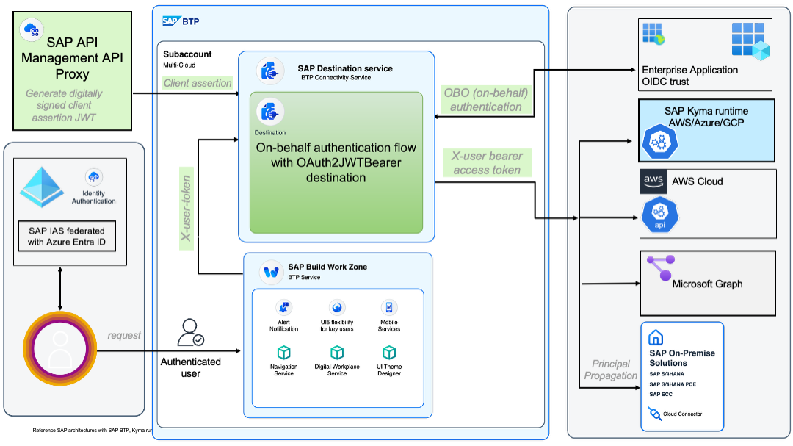

# Exercise 0 - Preparation Steps

You must have a personal github account for this session.  

## Exercise 0.0 - Sign up for a new GitHub account

This step is optional and you can be use instead any existing personal GitHub account of yours.

- Navigate to [GitHub](https://github.com/).
- Click **Sign up for GiHhub**.
- Otherwise, you may click on **Continue with Google** to sign up using your Google social login.
- Follow the prompts to create your personal account.

## Exercise 0.1 - Create a Copy of This Repository

 - Login to [GitHub](https://github.com/).
 - On the [main page of this repository](https://github.com/SAP-samples/teched2025-XP264), choose **Fork** on the top right.

<table style="width: 100%; border-collapse: collapse; background-color: #f5f5f5;" border="1">
<tbody>
<tr style="height: 193px;">
<td style="width: 71.6%; height: 193px;">

<h1></h1>

</td>
</tr>
</tbody>
</table>   

 - Make sure that the **Owner** matches the GitHub account that you want to use for this session. All the other information can remain the same.

<table style="width: 100%; border-collapse: collapse; background-color: #f5f5f5;" border="1">
<tbody>
<tr style="height: 193px;">
<td style="width: 71.6%; height: 193px;">

<h1></h1>

</td>
</tr>
</tbody>
</table>   

 - Choose **Create Fork**. You are now brought to a copy of the repository in your GitHub account.
 - Choose **Activate Github Action**

## Exercise 0.2 - Discover SAP-TechEd25-XP264 Business Technology Platform landscape

- SSO to the [SAP-TechEd25-XP264 Business Technology Platform - Cockpit](https://emea.cockpit.btp.cloud.sap/cockpit?idp=anuk8cmfw.accounts.ondemand.com#/globalaccount/c1f19148-71f7-4883-9f86-8d5ee7634dec)
- Use you student's credentials to login

<table style="width: 100%; border-collapse: collapse; background-color: #f5f5f5;" border="1">
<tbody>
<tr style="height: 193px;">
<td style="width: 71.6%; height: 193px;">

<h1></h1>

</td>
</tr>
</tbody>
</table>   

| Account Name              | Type        |                                                                                                                                Description |
| :------------------------ | :---------: | :------------------------------------------------------------------------------------------------------------------------ |
| btp-argocd                |  Session Master  | with a shared ArgoCD instance (with SSO for all participants)             |
| btp-bootstrap             |  Session Master  | XP264 session bootstrap context for the terraform automation. |
| btp-provider              |  Session Master  | with shared SAP HANA Cloud and Cloud Logging (SAML SSO) services instances.|
| btp-runtime               |  US EAST region  | Students runtime context with kyma environment in the us east region         |
| uk-south                  |  UK SOUTH region | Students runtime contexts with kyma environment in the uk south region         |
| japan-east                |  JAPAN EAST region | Students runtime contexts with kyma environment in the japan east region         |

Each student's runtime context has a preconfigured SAP Cloud Connector attached, for instance:

<table style="width: 100%; border-collapse: collapse; background-color: #f5f5f5;" border="1">
<tbody>
<tr style="height: 193px;">
<td style="width: 71.6%; height: 193px;">

<h1></h1>

</td>
</tr>
</tbody>
</table>   
 

Easy navigation with the session landscape site with your allocated student's user name:  

<table style="width: 100%; border-collapse: collapse; background-color: #f5f5f5;" border="1">
<tbody>
<tr style="height: 193px;">
<td style="width: 71.6%; height: 193px;">

<h1></h1>

</td>
</tr>
</tbody>
</table>   

## Exercise 0.3 - Solution brief. Funtional architecture

Here goes a diagram of the functional architecture of the solution

<table style="width: 100%; border-collapse: collapse; background-color: #f5f5f5;" border="1">
<tbody>
<tr style="height: 193px;">
<td style="width: 71.6%; height: 193px;">

<h1></h1>

</td>
</tr>
</tbody>
</table>   

## Summary

Now that you have everything you need to successfully go through this TechEd session:

- A GitHub account.
- Your own fork of the session's GitHub repository.
- Access to the SAP BTP managed kubernetes landscape with the easy navigation site
- An idea of the functional architecture behind the solution brief

Continue to [BTP Kyma easy with kyma CLI](../ex1/README.md)
