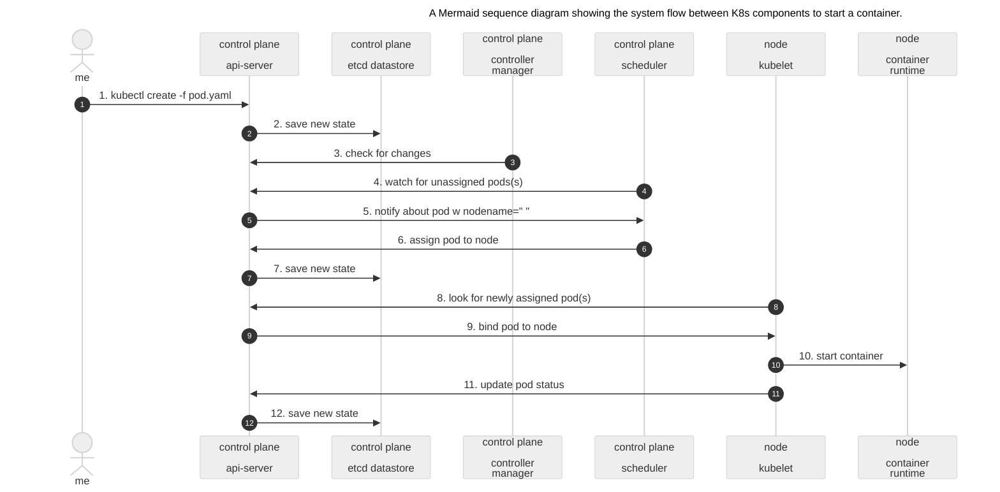

# Exercise 0 - Preparation Steps

You must have a personal github account for this session.  

## Exercise 0.0 - Sign up for a new GitHub account

This step is optional and you can be use instead any existing personal GitHub account of yours.

- Navigate to [GitHub](https://github.com/).
- Click **Sign up for GiHhub**.
- Otherwise, you may click on **Continue with Google** to sign up using your Google social login.
- Follow the prompts to create your personal account.

## Exercise 0.1 - Create a Copy of This Repository

 - Login to [GitHub](https://github.com/).
 - On the [main page of this repository](https://github.com/SAP-samples/teched2025-XP264), choose **Fork** on the top right.

<table style="width: 100%; border-collapse: collapse; background-color: #f5f5f5;" border="1">
<tbody>
<tr style="height: 193px;">
<td style="width: 71.6%; height: 193px;">

<h1></h1>

</td>
</tr>
</tbody>
</table>   

 - Make sure that the **Owner** matches the GitHub account that you want to use for this session. All the other information can remain the same.

<table style="width: 100%; border-collapse: collapse; background-color: #f5f5f5;" border="1">
<tbody>
<tr style="height: 193px;">
<td style="width: 71.6%; height: 193px;">

<h1></h1>

</td>
</tr>
</tbody>
</table>   

 - Choose **Create Fork**. You are now brought to a copy of the repository in your GitHub account.
 - Choose **Activate Github Action**

## Exercise 0.2 - The rules of the game

Access to the landscape via Easy Navigation dashboard:  

<table style="width: 100%; border-collapse: collapse; background-color: #f5f5f5;" border="1">
<tbody>
<tr style="height: 193px;">
<td style="width: 71.6%; height: 193px;">

<h1></h1>

</td>
</tr>
</tbody>
</table>  

The students can pick and choose any available kyma cluster region the following list:

| BTP region              | Kyma region        |                                                                                                                                Description |
| :------------------------ | :---------: | :------------------------------------------------------------------------------------------------------------------------ |
| us-east (eu20/azure)              |  US EAST region  | kyma environment with the cluster in the us east region         |
| uk-south (eu20/azure)                 |  UK SOUTH region | kyma environment with the cluster in the uk south region         |
| japan-east (eu20/azure)               |  JAPAN EAST region | kyma environment with the cluster in the japan east region         |
| xp264-00  (eu20/azure)             |  UK SOUTH region  | kyma environment with the cluster in the uk south region         |
| xp264-001  (eu10/aws)                |  EU Central region | kyma environment with the cluster in the eu central region         |
| xp264-050  (eu20/azure)              |  UK SOUTH region | kyma environment with the cluster in the uk south region        |

Good to know: 
- Each cluster has been configured to the same template with dedicated namespaces for each student.
- As this is an academic exercise, the complete user/namespace isolation has not been enforced.
 
Furthermore:
- The students do not have access to the master components of the landscape. 
- Any shared component access required for the session is granted via SSO with the links available from the Easy Navigation site.

## Exercise 0.3 - BTP landscape. Solution brief.

You've got SSO acces with your student's credentials to parts of the SAP-TechEd25-XP264 landscape.  

For instance, you may login to [SAP-TechEd25-XP264 Business Technology Platform - Cockpit](https://emea.cockpit.btp.cloud.sap/cockpit?idp=anuk8cmfw.accounts.ondemand.com#/globalaccount/c1f19148-71f7-4883-9f86-8d5ee7634dec) 

Good to know:  
- The BTP landscape has a number of subaccounts or **runtime contexts**.  
- The majority of runtime contexts are hosted in the same BTP region - in the EU20 data center (Azure/Netherlands)
- However, there are a few hosted in the EU10 data center (AWS/Francfort) as well.
- Each BTP subaccount can host a single kyma runtime environment.
- Each kyma runtime environment maps into a single kuberneters cluster in the Azure or AWS region of your choice.
- Please note the kyma cluster region may be different from the BTP subaccount region.

<table style="width: 100%; border-collapse: collapse; background-color: #f5f5f5;" border="1">
<tbody>
<tr style="height: 193px;">
<td style="width: 71.6%; height: 193px;">

<h1></h1>

</td>
</tr>
</tbody>
</table>   

Furthermore, each student's runtime context has a preconfigured SAP Cloud Connector attached, for instance:

<table style="width: 100%; border-collapse: collapse; background-color: #f5f5f5;" border="1">
<tbody>
<tr style="height: 193px;">
<td style="width: 71.6%; height: 193px;">

<h1></h1>

</td>
</tr>
</tbody>
</table>  

## Exercise 0.4 - SAP BTP, Kyma Runtime (SKR) architecture

There are two main components in the SAP BTP, Kyma Runtime architecture, namely:

  * Kyma Control Plane (KCP)
  * Kyma Runtime (SKR)

### Kyma Control Plane (KCP)  
Kyma Control Plane is a central component that manages the lifecycle of the Kyma Runtime clusters. It is responsible for deploying, configuring, and monitoring the underlying Kubernetes clusters and the Kyma modules running on them. KCP provides a unified interface for users to manage their clusters, install new modules, and monitor the health and performance of the runtime environment.  

Currently, the KCP is a single instance deployed in the Google Cloud Platform on top of GKE cluster. The future plan is to have multiple instances of KCP as to be able to support restricted markets and improve scalability.  

### Kyma Runtime (SKR)  
Each Kyma Runtime instance is a separate Kubernetes cluster managed by the KCP.  
Customers can pick and choose which Kyma modules to install on their runtime, based on their specific requirements.  
The Kyma modules provide additional functionality and services to the runtime environment, such as service mesh integration, serverless computing, telemetry, and API gateway.  
Some of the modules are added by default (istio, api-gateway and btp-operator), while others can be installed on request.

  * Kyma Runtime (SKR) architecture diagram 

<table style="width: 100%; border-collapse: collapse; background-color: #f5f5f5;" border="1">
<tbody>
<tr style="height: 193px;">
<td style="width: 71.6%; height: 193px;">

<h1></h1>

</td>
</tr>
</tbody>
</table> 

<!-- 
<table style="width: 100%; border-collapse: collapse; background-color: #f5f5f5;" border="1">
<tbody>
<tr style="height: 193px;">
<td style="width: 71.6%; height: 193px;">

<h3>Mermaid sequence diagram showing the system flow between K8s components to start a container.</h3>

</td>
</tr>
</tbody>
</table> 

--->

## Exercise 1.1 - Easy access to your teched landscape with SSO.

- This SAP Workzone dashboard is to assist you with the landscape discovery and ease the navigation thorugh the landscape components.
- Please use your allocated student's credentials to login...

<table style="width: 100%; border-collapse: collapse; background-color: #f5f5f5;" border="1">
<tbody>
<tr style="height: 193px;">
<td style="width: 71.6%; height: 193px;">

 
<h1></h1>

</td>
</tr>
</tbody>
</table>   
  

Here goes a diagram of the functional architecture of the solution

<table style="width: 100%; border-collapse: collapse; background-color: #f5f5f5;" border="1">
<tbody>
<tr style="height: 193px;">
<td style="width: 71.6%; height: 193px;">

<h1></h1>

</td>
</tr>
</tbody>
</table>   

## Summary

Now that you have everything you need to successfully go through this TechEd session:

- A GitHub account.
- Your own fork of the session's GitHub repository.
- Access to the SAP BTP managed kubernetes landscape with the easy navigation site
- An idea of the functional architecture behind the solution brief

Continue to [First things first. Getting to know SAP managed kubernetes runtime](../ex1/README.md)
