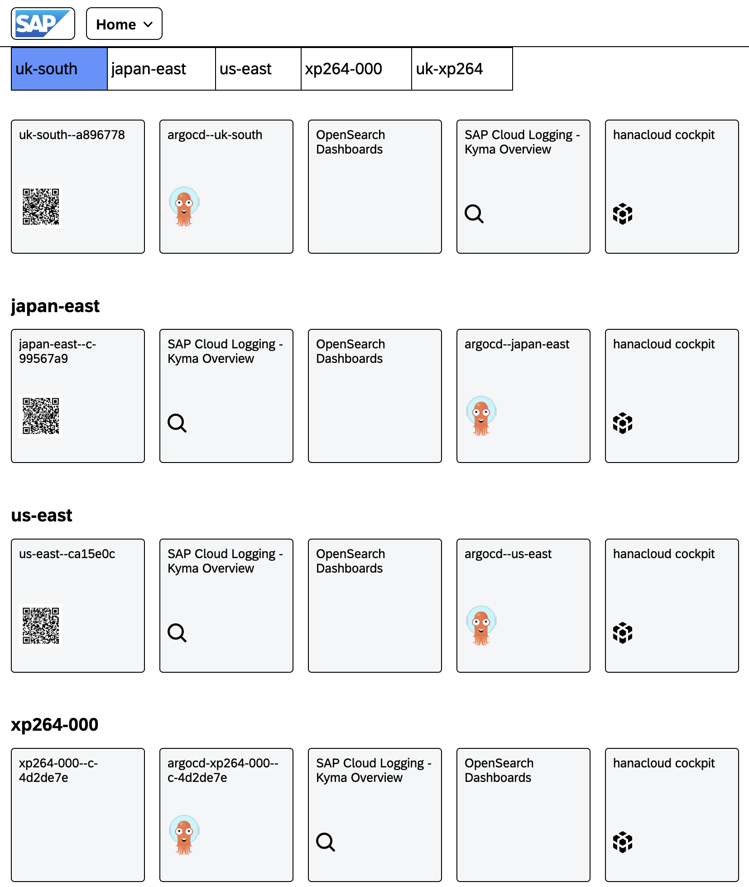
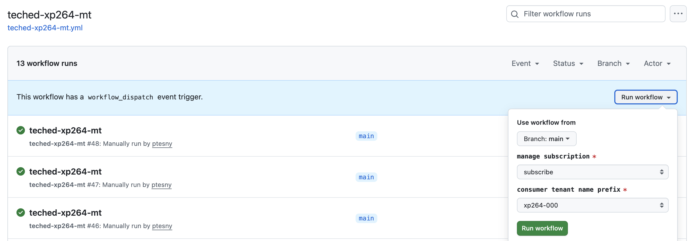
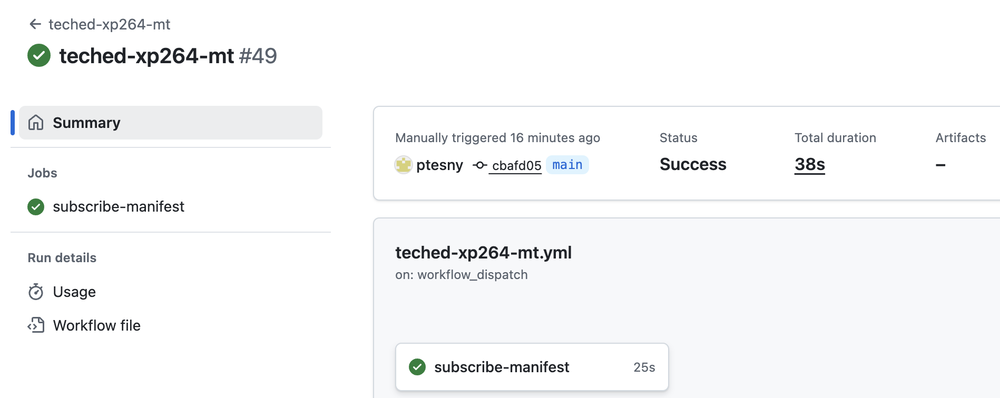
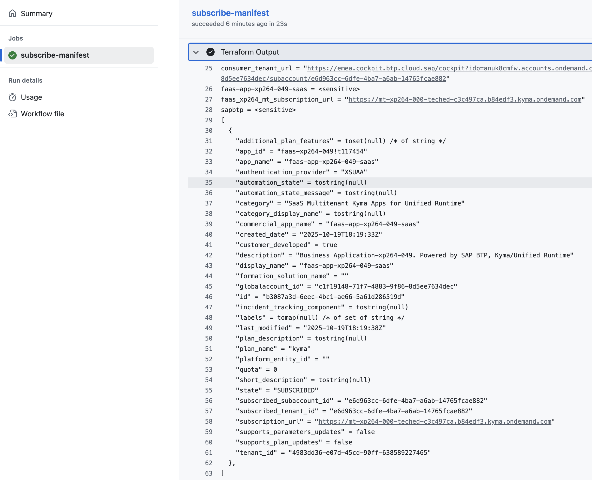
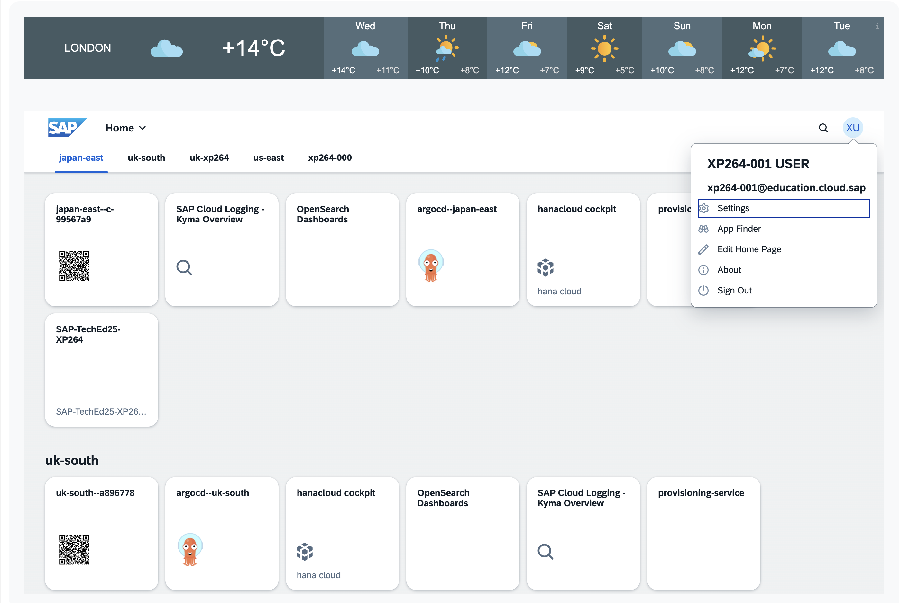

# Exercise 1 - First things first. Getting acquainted with SAP BTP, Kyma Runtime (SKR)


## Exercise 1.0 - Let's talk SAP BTP, Kyma Runtime (SKR) architecture


There are two main components in the SAP BTP, Kyma Runtime architecture, namely:

  * Kyma Control Plane (KCP)
  * Kyma Runtime (SKR)

### Kyma Control Plane (KCP)  
Kyma Control Plane is a central component that manages the lifecycle of the Kyma Runtime clusters. It is responsible for deploying, configuring, and monitoring the underlying Kubernetes clusters and the Kyma modules running on them. KCP provides a unified interface for users to manage their clusters, install new modules, and monitor the health and performance of the runtime environment.  

Currently, the KCP is a single instance deployed in the Google Cloud Platform on top of GKE cluster. The future plan is to have multiple instances of KCP as to be able to support restricted markets and improve scalability.  

### Kyma Runtime (SKR)  
Each Kyma Runtime instance is a separate Kubernetes cluster managed by the KCP.  
Customers can pick and choose which Kyma modules to install on their runtime, based on their specific requirements.  
The Kyma modules provide additional functionality and services to the runtime environment, such as service mesh integration, serverless computing, telemetry, and API gateway.  
Some of the modules are added by default (istio, api-gateway and btp-operator), while others can be installed on request.

  * Kyma Runtime (SKR) architecture diagram 

<table style="width: 100%; border-collapse: collapse; background-color: #f5f5f5;" border="1">
<tbody>
<tr style="height: 193px;">
<td style="width: 71.6%; height: 193px;">
<div>
<h1><a href="https://url.sap/3kf0ol"></a></h1>
</div>
</td>
</tr>
</tbody>
</table> 


## Exercise 1.1 - Easy access to your teched landscape with SSO.

  * To assist you with the landscape discovery and ease the navigation you may use the following dashboard.  
- Please use your allocated student's credentials to login...

<table style="width: 100%; border-collapse: collapse; background-color: #f5f5f5;" border="1">
<tbody>
<tr style="height: 193px;">
<td style="width: 71.6%; height: 193px;">
<div>
<h1><a href="https://url.sap/3kf0ol"></a></h1>
</div>
</td>
</tr>
</tbody>
</table>   


## Exercise 1.2 - Explore Kyma runtime environment with the ready made automation flows

- Does one always need to climb the mountain of the onboarding documentation?  
- Well, not necessarily.  
- A well-thought and designed landscape (Day-0/Day-1) would offer some built-in automation.  
- Both with some CI/CD workflows and Terraform automation

Let's have a look at different kyma clusters through the lenses of the ready made automation workflows...  

It's a bit like having blind date with SAP Kyma.  You are asked to run a few workflows that the Day-0/Day-1 team has designed and implemented.  
These worklows should allow to retrieve the key information about the state of the runtime environment... at a glance.  

Feel free to add any additional information you might like to retrieve...

 | Kyma Region |  Console (dashboard) | Admin Worklow | Student Workflow | Data Collection Workflow
 | :---------  | --------- | :--------- | :------- | -----------
 | [uk-south](https://emea.cockpit.btp.cloud.sap/cockpit?idp=anuk8cmfw.accounts.ondemand.com#/globalaccount/c1f19148-71f7-4883-9f86-8d5ee7634dec/subaccount/4457fb7f-3296-40cf-b66b-aac3d9d4a2b2) | [](https://dashboard.kyma.cloud.sap/?kubeconfigID=6D0AF763-179E-4F84-8ED0-724B3C0C2C92) | [uk-south--admin](../../../../actions/workflows/uk-south-teched-7a69075f-7faf-4604-a62e-806648791dba.yml) | [uk-south--xp264](../../../../actions/workflows/uk-south-teched-7a69075f-7faf-4604-a62e-806648791dba-xp264.yml)| [ k8s-data-context](../../../../actions/workflows/k8s-data-context-student.yml)
 | [japan-east](https://emea.cockpit.btp.cloud.sap/cockpit?idp=anuk8cmfw.accounts.ondemand.com#/globalaccount/c1f19148-71f7-4883-9f86-8d5ee7634dec/subaccount/cae18034-657b-478d-89f7-b802b8111cd0) | [](https://dashboard.kyma.cloud.sap/?kubeconfigID=79EB720B-2C16-4A7E-AA7F-108C4E3B7E98 ) | [japan-east--admin](../../../../actions/workflows/japan-east-teched-2a6fe480-ac84-4751-ad37-56ec2a493932.yml) | [japan-east--xp264](../../../../actions/workflows/japan-east-teched-2a6fe480-ac84-4751-ad37-56ec2a493932-xp264.yml) | [k8s-data-context](../../../../actions/workflows/k8s-data-context-student.yml)
 | [us-east](https://emea.cockpit.btp.cloud.sap/cockpit?idp=anuk8cmfw.accounts.ondemand.com#/globalaccount/c1f19148-71f7-4883-9f86-8d5ee7634dec/subaccount/831741eb-0b10-4d2c-9feb-c49afec286f5) | [](https://dashboard.kyma.cloud.sap/?kubeconfigID=72A4A32B-0D0A-47DE-90C9-A65D52C8ADBE) | [us-east--admin](../../../../actions/workflows/btp-runtime-teched-dbe7346b-88da-430a-8777-4f6aa3e22b5e.yml) | [us-east--xp264](../../../../actions/workflows/btp-runtime-teched-dbe7346b-88da-430a-8777-4f6aa3e22b5e-xp264.yml) | [k8s-data-context](../../../../actions/workflows/k8s-data-context-student.yml)
 | [xp264-000](https://emea.cockpit.btp.cloud.sap/cockpit?idp=anuk8cmfw.accounts.ondemand.com#/globalaccount/c1f19148-71f7-4883-9f86-8d5ee7634dec/subaccount/20b6061c-64aa-4397-bc01-df7348704173) | [](https://dashboard.kyma.cloud.sap/?kubeconfigID=B427F082-0D0C-4657-9D99-56629CC03CF6 ) | [xp264-000--admin](../../../../actions/workflows/xp264-000-teched-622af3fe-a2f5-4fdd-a05f-73e343aec2a5.yml) | [xp264-000--xp264](../../../../actions/workflows/xp264-000-teched-622af3fe-a2f5-4fdd-a05f-73e343aec2a5-xp264.yml) | [k8s-data-context](../../../../actions/workflows/k8s-data-context-student.yml)
 | [uk-xp264]() | [](https://dashboard.kyma.cloud.sap/?kubeconfigID=0FD84322-535C-4047-89CE-47FC775938FC ) | [uk-xp264--admin](../../../../actions/workflows/uk-xp264-teched-76f46b5b-d9ab-486f-8e4f-12e1163af943.yml) | [uk-xp264--xp264](../../../../actions/workflows/uk-xp264-teched-76f46b5b-d9ab-486f-8e4f-12e1163af943-xp264.yml) | [k8s-data-context](../../../../actions/workflows/k8s-data-context-student.yml)


Good to know:
- For the best experience, please use the right click to open workflow links into a tab or into a new window.  
- The ready made CI/CD workflows are to be manually triggered, for instance:  
  * admin (cluster-wide) and students (namespaced) flows:


<table style="width: 100%; border-collapse: collapse; background-color: #f5f5f5;" border="1">
<tbody>
<tr style="height: 193px;">
<td style="width: 71.6%; height: 193px;">
<div>
<h1><a href="https://dashboard.kyma.cloud.sap/?kubeconfigID=79EB720B-2C16-4A7E-AA7F-108C4E3B7E98">
<p float="left">
  
  
   
   
</p>
</a></h1>
</div>
</td>
</tr>
</tbody>
</table> 

- Diagnostic data collection with both Kyma CLI and Terraform providers, namely:
- SAP BTP, 
- kubernetes and 
- kubectl

  * diagnostic data (namespaced) flow

<table style="width: 100%; border-collapse: collapse; background-color: #f5f5f5;" border="1">
<tbody>
<tr style="height: 193px;">
<td style="width: 71.6%; height: 193px;">
<div>
<h1><a href="https://dashboard.kyma.cloud.sap/?kubeconfigID=79EB720B-2C16-4A7E-AA7F-108C4E3B7E98">
<p float="left">
  
   
   
</p>
</a></h1>
</div>
</td>
</tr>
</tbody>
</table> 

Good to know: 
- The security is paramount!
- The automated workflows leverage the dynamic OIDC credentials with Github Actions acting as the IDP provider. 
- Thus, there is no need to rely on static credentials or use any vault
- The implemented mechanism ensure the credentials are rotated automatically which makes is suitable for long running pipelines as well.


Homework:
- Think about nny additional information you might like to add or amend...

## Exercise 1.3 - Zoom on Kyma CLI

Quoting after [Kyma CLI | SAP Help](https://help.sap.com/docs/btp/sap-business-technology-platform/kyma-cli):  

> Kyma CLI is an essential tool for application developers who want to get started quickly and efficiently with SAP BTP, Kyma runtime. Designed to streamline workflows, it simplifies complex tasks, enabling developers to deploy and manage applications easily.

Good to know: 
- It is already pre-installed on the tech laptops.  
- It is also available out-of-the-box in the automation workflows for this session.

```
kyma version
Kyma-CLI Version: 3.2.0
```

```
kyma -h     
Use this command to manage Kyma modules and resources on a cluster.

Usage:
  kyma [command]

Available Commands:
  alpha       Groups command prototypes for which the API may still change
  app         Manages applications on the Kubernetes cluster
  completion  Generate the autocompletion script for the specified shell
  function    A set of commands for managing Functions
  help        Help about any command
  module      Manages Kyma modules
  version     Displays the version of Kyma CLI

Flags:
  -h, --help                    Help for the command
      --kubeconfig string       Path to the Kyma kubeconfig file
      --show-extensions-error   Prints a possible error when fetching extensions fails
      --skip-extensions         Skip fetching extensions from the target Kyma environment

Use "kyma [command] --help" for more information about a command.
```

Alternatively, [Kyma CLI action](https://github.com/marketplace/actions/setup-kyma-cli) is already part of the automated CI/CD workflows and is available for installation in pipeline from the [github actions marketplace](https://github.com/marketplace?query=kyma).  


```
- uses: kyma-project/setup-kyma-cli@v1
  with:
    - version: latest
```

Please get familiar with the available [commands](https://github.com/kyma-project/cli/tree/3.2.0/docs/user/gen-docs)... 

## Exercise 1.4 - Fire-fighter access to your kyma cluster


  * Download the OIDC kubeconfig from the kyma dashboard.  

  This method requires a kubectl oidc plugin (already pre-installed) and cannot be performed from a headless context, for instance from a CI/CD pipeline or workflow.  

  Access SAP Kyma dashboard.  
  You can use the easy navigation landscape dashboard with your allocated student's user name or use one of the kyma dashboard deep links below:


  * Here goes the table with the links to all btp and k8s resources...  

  | Region | Kubeconfig (download) | Console (dashboard) | Admin Worklow | Student Workflow | Data Collection Workflow
 | :--------- | :---------:  | --------- | :--------- | :------- | -----------
 | [uk-south](https://emea.cockpit.btp.cloud.sap/cockpit?idp=anuk8cmfw.accounts.ondemand.com#/globalaccount/c1f19148-71f7-4883-9f86-8d5ee7634dec/subaccount/4457fb7f-3296-40cf-b66b-aac3d9d4a2b2) | https://url.sap/q9176k | [](https://dashboard.kyma.cloud.sap/?kubeconfigID=6D0AF763-179E-4F84-8ED0-724B3C0C2C92) | [uk-south--admin](../../../../actions/workflows/uk-south-teched-7a69075f-7faf-4604-a62e-806648791dba.yml) | [uk-south--xp264](../../../../actions/workflows/uk-south-teched-7a69075f-7faf-4604-a62e-806648791dba-xp264.yml)| [ k8s-data-context](../../../../actions/workflows/k8s-data-context-teched.yml)
 | [japan-east](https://emea.cockpit.btp.cloud.sap/cockpit?idp=anuk8cmfw.accounts.ondemand.com#/globalaccount/c1f19148-71f7-4883-9f86-8d5ee7634dec/subaccount/cae18034-657b-478d-89f7-b802b8111cd0) | https://url.sap/0nusi8 | [](https://dashboard.kyma.cloud.sap/?kubeconfigID=79EB720B-2C16-4A7E-AA7F-108C4E3B7E98 ) | [japan-east--admin](../../../../actions/workflows/japan-east-teched-2a6fe480-ac84-4751-ad37-56ec2a493932.yml) | [japan-east--xp264](../../../../actions/workflows/japan-east-teched-2a6fe480-ac84-4751-ad37-56ec2a493932-xp264.yml) | [k8s-data-context](../../../../actions/workflows/k8s-data-context-teched.yml)
 | [us-east](https://emea.cockpit.btp.cloud.sap/cockpit?idp=anuk8cmfw.accounts.ondemand.com#/globalaccount/c1f19148-71f7-4883-9f86-8d5ee7634dec/subaccount/831741eb-0b10-4d2c-9feb-c49afec286f5) | https://url.sap/57qy47 | [](https://dashboard.kyma.cloud.sap/?kubeconfigID=72A4A32B-0D0A-47DE-90C9-A65D52C8ADBE) | [us-east--admin](../../../../actions/workflows/btp-runtime-teched-dbe7346b-88da-430a-8777-4f6aa3e22b5e.yml) | [us-east--xp264](../../../../actions/workflows/btp-runtime-teched-dbe7346b-88da-430a-8777-4f6aa3e22b5e-xp264.yml) | [k8s-data-context](../../../../actions/workflows/k8s-data-context-teched.yml)
 | [xp264-000](https://emea.cockpit.btp.cloud.sap/cockpit?idp=anuk8cmfw.accounts.ondemand.com#/globalaccount/c1f19148-71f7-4883-9f86-8d5ee7634dec/subaccount/20b6061c-64aa-4397-bc01-df7348704173) | https://url.sap/jdleyl | [](https://dashboard.kyma.cloud.sap/?kubeconfigID=B427F082-0D0C-4657-9D99-56629CC03CF6 ) | [xp264-000--admin](../../../../actions/workflows/xp264-000-teched-622af3fe-a2f5-4fdd-a05f-73e343aec2a5.yml) | [xp264-000--xp264](../../../../actions/workflows/xp264-000-teched-622af3fe-a2f5-4fdd-a05f-73e343aec2a5-xp264.yml) | [k8s-data-context](../../../../actions/workflows/k8s-data-context-teched.yml)
 | [uk-xp264]() |https://url.sap/tyapw7 | [](https://dashboard.kyma.cloud.sap/?kubeconfigID=0FD84322-535C-4047-89CE-47FC775938FC ) | [uk-xp264--admin](../../../../actions/workflows/uk-xp264-teched-76f46b5b-d9ab-486f-8e4f-12e1163af943.yml) | [uk-xp264--xp264](../../../../actions/workflows/uk-xp264-teched-76f46b5b-d9ab-486f-8e4f-12e1163af943-xp264.yml) | [k8s-data-context](../../../../actions/workflows/k8s-data-context-teched.yml)

  * Create a permenent or temporary service account based kubeconfig (with uk-south)
  Choose the uk-south tile or click on the provided deep link

```
kyma alpha kubeconfig generate --serviceaccount kyma-cli-sa --clusterrole cluster-admin --namespace default --permanent  --kubeconfig ~/.kube/kubeconfig--garden-kyma--a896778-external.yaml


kyma alpha kubeconfig generate --serviceaccount kyma-cli-sa --clusterrole cluster-admin --namespace default --time 1h  --kubeconfig ~/.kube/kubeconfig--garden-kyma--a896778-external.yaml

apiVersion: v1
clusters:
- cluster:
    certificate-authority-data: LS0tLS1CRUdJTiBDRVJUSUZJQ0FURS0tLS0tCk1JSUQ1ekNDQWsrZ0F3SUJBZ0lSQUt3bWpnd1VwQTQ5Rkw2Mkp3Zm56Y2d3RFFZSktvWklodmNOQVFFTEJRQXcKRFRFTE1Ba0dBM2ovNzZqWjdXei9BQU9PT2pjUzZVUnRRY0tSellIckRlZlVGdVJXUEVxWkRXTmxBPT0KLS0tLS1FTkQgQ0VSVElGSUNBVEUtLS0tLQo=
    server: https://api.a896778.kyma.ondemand.com
  name: garden-kyma--a896778-external
contexts:
- context:
    cluster: garden-kyma--a896778-external
    namespace: default
    user: kyma-cli-sa
  name: garden-kyma--a896778-external
current-context: garden-kyma--a896778-external
kind: Config
preferences: {}
users:
- name: kyma-cli-sa
  user:
    token: eyJhbGciOiJSUzI1NiIsImtpZCI6IlRvQlNSVXRhekVNQWpLaE11SF9Ga0lrUUlCTG5ZQUV3dk9wc3Z5czJZR2MifQ.***
```


```
kyma alpha kubeconfig generate --serviceaccount kyma-cli-sa --clusterrole cluster-admin --namespace default --permanent  --kubeconfig ~/.kube/kubeconfig--garden-kyma--a896778-external.yaml > ~/.kube/kubeconfig--a896778.yaml


kyma alpha kubeconfig generate --serviceaccount xp264-000-sa  --namespace xp264-000 --permanent  --kubeconfig ~/.kube/kubeconfig--garden-kyma--a896778-external.yaml
```

  * read-only access in a given namespace

```
kyma alpha kubeconfig generate --serviceaccount kyma-cli-view-sa  --namespace default --permanent --clusterrole view --kubeconfig ~/.kube/kubeconfig--garden-kyma--a896778-external.yaml
```

  * cluster-wide read-only access

```
kyma alpha kubeconfig generate --serviceaccount kyma-cli-view-sa  --namespace default --permanent --clusterrole view --cluster-wide --kubeconfig ~/.kube/kubeconfig--garden-kyma--a896778-external.yaml


kyma alpha kubeconfig generate --serviceaccount xp264-000-sa  --namespace xp264-000 --permanent --clusterrole view --cluster-wide --kubeconfig ~/.kube/kubeconfig--garden-kyma--a896778-external.yaml
```  


## Exercise 1.5 - Getting to know your kyma cluster better

Let's leverage the kyma cli to get simple metadata from a kyma cluster

```
kyma alpha diagnose -f json | jq '.metadata'
{
  "globalAccountID": "4c526f8b-cca9-4837-8b43-87824e3a4d10",
  "subaccountID": "5524c764-8893-4530-8eb8-feb9e6110f16",
  "clusterID": "eef5b822-8f8f-4d08-af05-f26aafe252b8",
  "clusterDomain": "a416537.stage.kyma.ondemand.com",
  "region": "uksouth",
  "shootName": "a416537",
  "provider": "azure",
  "kubernetesVersion": "1.33.3",
  "natGatewayIPs": [
    "172.167.242.76,",
    "172.187.130.162,",
    "172.187.211.228"
  ],
  "gardenerExtensions": [
    "shoot-auditlog-service",
    "shoot-cert-service",
    "shoot-dns-service",
    "shoot-lakom-service",
    "shoot-networking-filter",
    "shoot-networking-problemdetector",
    "shoot-oidc-service"
  ],
  "kubeAPIServer": "https://api.a416537.stage.kyma.ondemand.com"
}
```

  * Let's use the above information to build the deep link to the BTP subaccount with the kyma runtime environment.  
  * Use the link to inspect the BTP side of the kyma house....
  * Goto the [landscape dashboard](https://url.sap/3kf0ol) and choose the right environment...
  * Scramble the kyma runtime environment with the BTP Provisioning Service REST APIs

```
kyma alpha diagnose -f json | jq '.nodes[] | tojson'

"{\"machineInfo\":{\"name\":\"shoot--kyma-stage--a416537-cpu-worker-0-z1-69d94-hd29q\",\"architecture\":\"amd64\",\"kernelVersion\":\"6.12.47-cloud-amd64\",\"osImage\":\"Garden Linux 1877.4\",\"containerRuntime\":\"containerd://2.1.4\",\"kubeletVersion\":\"v1.33.3\",\"operatingSystem\":\"linux\"},\"capacity\":{\"cpu\":\"4\",\"memory\":\"16384092Ki\",\"eph
```

After completing these steps you will have...


## Exercise 1.6 - Accessing other diagnostic information with btp and kubernetes terraform providers

Run the following github action: 


## Exercise 1.7 - BTP multitenancy with kyma

In order to subscribe or to retrieve an existing subscription for your user run the following github action: 

| Runn Subscription workflow | Retrieve the subscription URL
| -------- | ------------- |
[teched-xp264-mt](../../../../actions/workflows/teched-xp264-mt.yml) | read the subscription URL in the workflow output


<table style="width: 100%; border-collapse: collapse; background-color: #f5f5f5;" border="1">
<tbody>
<tr style="height: 193px;">
<td style="width: 71.6%; height: 193px;">
<div>
<h1><a href="https://dashboard.kyma.cloud.sap/?kubeconfigID=79EB720B-2C16-4A7E-AA7F-108C4E3B7E98">
<p float="left">
  
  
   
   
</p>
</a></h1>
</div>
</td>
</tr>
</tbody>
</table> 

## Summary

You've now ...

Continue to - [Exercise 2 - Exercise 2 Description](../ex2/README.md)

