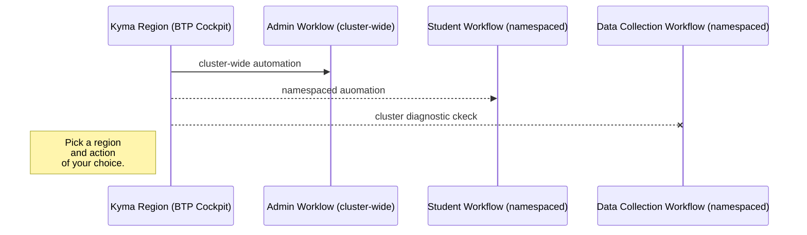

# Exercise 1 - First things first. Getting acquainted with SAP BTP, Kyma Runtime (SKR)


## Exercise 1.0 - Let's talk SAP BTP, Kyma Runtime (SKR) architecture


There are two main components in the SAP BTP, Kyma Runtime architecture, namely:

  * Kyma Control Plane (KCP)
  * Kyma Runtime (SKR)

### Kyma Control Plane (KCP)  
Kyma Control Plane is a central component that manages the lifecycle of the Kyma Runtime clusters. It is responsible for deploying, configuring, and monitoring the underlying Kubernetes clusters and the Kyma modules running on them. KCP provides a unified interface for users to manage their clusters, install new modules, and monitor the health and performance of the runtime environment.  

Currently, the KCP is a single instance deployed in the Google Cloud Platform on top of GKE cluster. The future plan is to have multiple instances of KCP as to be able to support restricted markets and improve scalability.  

### Kyma Runtime (SKR)  
Each Kyma Runtime instance is a separate Kubernetes cluster managed by the KCP.  
Customers can pick and choose which Kyma modules to install on their runtime, based on their specific requirements.  
The Kyma modules provide additional functionality and services to the runtime environment, such as service mesh integration, serverless computing, telemetry, and API gateway.  
Some of the modules are added by default (istio, api-gateway and btp-operator), while others can be installed on request.

  * Kyma Runtime (SKR) architecture diagram 

<table style="width: 100%; border-collapse: collapse; background-color: #f5f5f5;" border="1">
<tbody>
<tr style="height: 193px;">
<td style="width: 71.6%; height: 193px;">
<div>
<h1><a href="https://url.sap/3kf0ol"></a></h1>
</div>
</td>
</tr>
</tbody>
</table> 


## Exercise 1.1 - Easy access to your teched landscape with SSO.

- This SAP Workzone dashboard is to assist you with the landscape discovery and ease the navigation thorugh the landscape components.
- Please use your allocated student's credentials to login...

<table style="width: 100%; border-collapse: collapse; background-color: #f5f5f5;" border="1">
<tbody>
<tr style="height: 193px;">
<td style="width: 71.6%; height: 193px;">
<div>
<h1><a href="https://url.sap/3kf0ol"></a></h1>
</div>
</td>
</tr>
</tbody>
</table>   


## Exercise 1.2 - Built-in github actions automation flows

Does one always need to climb the mountain of the onboarding documentation? Not necessarily.  
A well-thought and designed landscape (Day-0/Day-1) would offer some built-in automation.  
Good to know:  
- This landscape features a number of pre-configured CI/CD github action workflows and Terraform automations.
- The workflows templates have been automatically generated by the Day-1 landscape
- The Day-2 teams have a solid set of automated worfklows to build upon their Day-2/SRE operational model

In this exercise you will:  
- 👉 Explore Kyma runtime environments with the built-in automation flows.  
- 👉 Retrieve the key information about the state of the runtime environment... at a glance.  
- 👉 Both securely and effortlessly!

Do it yourself...
- 👉 Pick a region and action of your choice...
- 👉 Have fun...

<table style="width: 100%; border-collapse: collapse; background-color: #f5f5f5;" border="1">
<tbody>
<tr style="height: 193px;">
<td style="width: 71.6%; height: 193px;">

<div>



</div>

<div>

- The pre-configured CI/CD automation workflows are to be manually triggered. They come in two flavors, namely:
  * admin (cluster-wide)
  * students (namespaced) flows as depicted below:

| Kyma Region (BTP Cockpit) |  Console (dashboard) | Admin Worklow (cluster-wide) | Student Workflow (namespaced)| Data Collection Workflow (namespaced)
 | :---------  | --------- | :--------- | :------- | -----------
 | [uk-south](https://emea.cockpit.btp.cloud.sap/cockpit?idp=anuk8cmfw.accounts.ondemand.com#/globalaccount/c1f19148-71f7-4883-9f86-8d5ee7634dec/subaccount/4457fb7f-3296-40cf-b66b-aac3d9d4a2b2) | [](https://dashboard.kyma.cloud.sap/?kubeconfigID=6D0AF763-179E-4F84-8ED0-724B3C0C2C92) | [uk-south--admin](../../../../actions/workflows/uk-south-teched-7a69075f-7faf-4604-a62e-806648791dba.yml) | [uk-south--xp264](../../../../actions/workflows/uk-south-teched-7a69075f-7faf-4604-a62e-806648791dba-xp264.yml)| [ k8s-data-context-student](../../../../actions/workflows/k8s-data-context-student.yml)
 | [japan-east](https://emea.cockpit.btp.cloud.sap/cockpit?idp=anuk8cmfw.accounts.ondemand.com#/globalaccount/c1f19148-71f7-4883-9f86-8d5ee7634dec/subaccount/cae18034-657b-478d-89f7-b802b8111cd0) | [](https://dashboard.kyma.cloud.sap/?kubeconfigID=79EB720B-2C16-4A7E-AA7F-108C4E3B7E98 ) | [japan-east--admin](../../../../actions/workflows/japan-east-teched-2a6fe480-ac84-4751-ad37-56ec2a493932.yml) | [japan-east--xp264](../../../../actions/workflows/japan-east-teched-2a6fe480-ac84-4751-ad37-56ec2a493932-xp264.yml) | [k8s-data-context-student](../../../../actions/workflows/k8s-data-context-student.yml)
 | [us-east](https://emea.cockpit.btp.cloud.sap/cockpit?idp=anuk8cmfw.accounts.ondemand.com#/globalaccount/c1f19148-71f7-4883-9f86-8d5ee7634dec/subaccount/831741eb-0b10-4d2c-9feb-c49afec286f5) | [](https://dashboard.kyma.cloud.sap/?kubeconfigID=72A4A32B-0D0A-47DE-90C9-A65D52C8ADBE) | [us-east--admin](../../../../actions/workflows/btp-runtime-teched-dbe7346b-88da-430a-8777-4f6aa3e22b5e.yml) | [us-east--xp264](../../../../actions/workflows/btp-runtime-teched-dbe7346b-88da-430a-8777-4f6aa3e22b5e-xp264.yml) | [k8s-data-context-student](../../../../actions/workflows/k8s-data-context-student.yml)
 | [xp264-000](https://emea.cockpit.btp.cloud.sap/cockpit?idp=anuk8cmfw.accounts.ondemand.com#/globalaccount/c1f19148-71f7-4883-9f86-8d5ee7634dec/subaccount/20b6061c-64aa-4397-bc01-df7348704173) | [](https://dashboard.kyma.cloud.sap/?kubeconfigID=B427F082-0D0C-4657-9D99-56629CC03CF6 ) | [xp264-000--admin](../../../../actions/workflows/xp264-000-teched-622af3fe-a2f5-4fdd-a05f-73e343aec2a5.yml) | [xp264-000--xp264](../../../../actions/workflows/xp264-000-teched-622af3fe-a2f5-4fdd-a05f-73e343aec2a5-xp264.yml) | [k8s-data-context-student](../../../../actions/workflows/k8s-data-context-student.yml)
 | [uk-xp264]() | [](https://dashboard.kyma.cloud.sap/?kubeconfigID=0FD84322-535C-4047-89CE-47FC775938FC ) | [uk-xp264--admin](../../../../actions/workflows/uk-xp264-teched-76f46b5b-d9ab-486f-8e4f-12e1163af943.yml) | [uk-xp264--xp264](../../../../actions/workflows/uk-xp264-teched-76f46b5b-d9ab-486f-8e4f-12e1163af943-xp264.yml) | [k8s-data-context-student](../../../../actions/workflows/k8s-data-context-student.yml)

</div>  
</td>
</tr>
</tbody>
</table>  


- 👉 For the best experience, do open workflow links into a separate tab or into a new window (right click).  

Explanation. What happened?
- The pre-configured CI/CD automation workflows are to be manually triggered. They come in two flavors, namely:
  * admin (cluster-wide)
  * students (namespaced) flows as depicted below:


<table style="width: 100%; border-collapse: collapse; background-color: #f5f5f5;" border="1">
<tbody>
<tr style="height: 193px;">
<td style="width: 71.6%; height: 193px;">
<div>
<h1><a href="https://dashboard.kyma.cloud.sap/?kubeconfigID=79EB720B-2C16-4A7E-AA7F-108C4E3B7E98">
<p float="left">
  
  
   
   
</p>
</a></h1>
</div>
</td>
</tr>
</tbody>
</table> 
They feature a number of steps. Each step represents a dedicated task.

- Diagnostic data collection from kyma clusters is done using both Kyma CLI and with several Terraform providers, namely:
  * SAP BTP TF provider
  * kubernetes provider 
  * kubectl provider

- diagnostic data (namespaced) flow

<table style="width: 100%; border-collapse: collapse; background-color: #f5f5f5;" border="1">
<tbody>
<tr style="height: 193px;">
<td style="width: 71.6%; height: 193px;">
<div>
<h1><a href="https://dashboard.kyma.cloud.sap/?kubeconfigID=79EB720B-2C16-4A7E-AA7F-108C4E3B7E98">
<p float="left">
  
   
   
</p>
</a></h1>
</div>
</td>
</tr>
</tbody>
</table> 

Good to know: 
- The security is paramount!
- The automated workflows leverage the dynamic OIDC credentials with Github Actions acting as the OIDC token provider in the context of a running job. 
- Thus, there is no need to rely on static credentials or be compelled to use a vault.
- The implemented mechanism ensures the credentials are rotated automatically which makes is suitable for long running pipelines as well.

What is happening ?

- These workflows automatically: 
  - 🔐 use GitHub's OIDC token for secure authentication
  - ⚙️ set up your Kubernetes context (kubeconfig)
  - 🚀 enable you to run kubectl commands in your workflow
  - 🚀 enable you to run kyma cli commands in your workflow
  - 🚀 enable you to run terraform automation in your workflow

  **Benefits:**

  - ✅ No need to store Kubernetes credentials as secrets
  - ✅ Enhanced security through short-lived tokens
  - ✅ Automatic token rotation
  - ✅ Fine-grained access control

📖 Learn more: [Using GitHub Actions OpenID Connect in Kubernetes](https://blogs.sap.com/2022/09/23/using-github-actions-openid-connect-in-kubernetes/)


Excercise takeaways:
- Think about any additional cluster information you might like to add or amend...

## Exercise 1.3 - Zoom on Kyma CLI

 - In a nutshell, Kyma CLI extends the capabilities of the ubiquitous kubectl CLI to a range of kyma specific features.  

- [Kyma CLI action](https://github.com/marketplace/actions/setup-kyma-cli) is already part of the automated CI/CD workflows
- It is available for installation in pipelines from the [github actions marketplace](https://github.com/marketplace?query=kyma).  

```
- uses: kyma-project/setup-kyma-cli@v1
  with:
    - version: latest
```


Good to know: 
- It is already pre-installed on the tech laptops.  
- It is also available out-of-the-box in the automation workflows prepared for this session.

👉 run `kyma version`

```
Kyma-CLI Version: 3.2.0
```

👉 run kyma -h
```
kyma -h     
Use this command to manage Kyma modules and resources on a cluster.

Usage:
  kyma [command]

Available Commands:
  alpha       Groups command prototypes for which the API may still change
  app         Manages applications on the Kubernetes cluster
  completion  Generate the autocompletion script for the specified shell
  function    A set of commands for managing Functions
  help        Help about any command
  module      Manages Kyma modules
  version     Displays the version of Kyma CLI

Flags:
  -h, --help                    Help for the command
      --kubeconfig string       Path to the Kyma kubeconfig file
      --show-extensions-error   Prints a possible error when fetching extensions fails
      --skip-extensions         Skip fetching extensions from the target Kyma environment

Use "kyma [command] --help" for more information about a command.
```


Please get familiar with the available [commands](https://github.com/kyma-project/cli/tree/3.2.0/docs/user/gen-docs)... 

## Exercise 1.4 - Fire-fighter access to your kyma cluster

There are two ways to gain access to a kyma cluster in XP264 session landscape, namely:
- from a terminal window using the downloaded user OIDC kubeconfig with either `kubectl` or `kyma CLI` and
- from within a github action workflow and/or terraform automation (preferred way)


The first method requires a kubectl oidc plugin (already pre-installed on the laptops) and cannot be performed in a headless context, for instance from a CI/CD pipeline or workflow.  

You can initially download the kubeconfig from one of the links below or directly from any SAP Kyma dashboard.  

* Here goes the table with the links to all btp and k8s resources...  

| Region (BTP Cockpit) | Kubeconfig (download) | Console (dashboard) | Admin Worklow (cluster-wide) | Student Workflow (namespaced) | Data Collection Workflow (cluster-wide)
| :--------- | :---------:  | --------- | :--------- | :------- | -----------
| [uk-south](https://emea.cockpit.btp.cloud.sap/cockpit?idp=anuk8cmfw.accounts.ondemand.com#/globalaccount/c1f19148-71f7-4883-9f86-8d5ee7634dec/subaccount/4457fb7f-3296-40cf-b66b-aac3d9d4a2b2) | https://url.sap/q9176k | [](https://dashboard.kyma.cloud.sap/?kubeconfigID=6D0AF763-179E-4F84-8ED0-724B3C0C2C92) | [uk-south--admin](../../../../actions/workflows/uk-south-teched-7a69075f-7faf-4604-a62e-806648791dba.yml) | [uk-south--xp264](../../../../actions/workflows/uk-south-teched-7a69075f-7faf-4604-a62e-806648791dba-xp264.yml)| [ k8s-data-context](../../../../actions/workflows/k8s-data-context-teched.yml)
| [japan-east](https://emea.cockpit.btp.cloud.sap/cockpit?idp=anuk8cmfw.accounts.ondemand.com#/globalaccount/c1f19148-71f7-4883-9f86-8d5ee7634dec/subaccount/cae18034-657b-478d-89f7-b802b8111cd0) | https://url.sap/0nusi8 | [](https://dashboard.kyma.cloud.sap/?kubeconfigID=79EB720B-2C16-4A7E-AA7F-108C4E3B7E98 ) | [japan-east--admin](../../../../actions/workflows/japan-east-teched-2a6fe480-ac84-4751-ad37-56ec2a493932.yml) | [japan-east--xp264](../../../../actions/workflows/japan-east-teched-2a6fe480-ac84-4751-ad37-56ec2a493932-xp264.yml) | [k8s-data-context](../../../../actions/workflows/k8s-data-context-teched.yml)
| [us-east](https://emea.cockpit.btp.cloud.sap/cockpit?idp=anuk8cmfw.accounts.ondemand.com#/globalaccount/c1f19148-71f7-4883-9f86-8d5ee7634dec/subaccount/831741eb-0b10-4d2c-9feb-c49afec286f5) | https://url.sap/57qy47 | [](https://dashboard.kyma.cloud.sap/?kubeconfigID=72A4A32B-0D0A-47DE-90C9-A65D52C8ADBE) | [us-east--admin](../../../../actions/workflows/btp-runtime-teched-dbe7346b-88da-430a-8777-4f6aa3e22b5e.yml) | [us-east--xp264](../../../../actions/workflows/btp-runtime-teched-dbe7346b-88da-430a-8777-4f6aa3e22b5e-xp264.yml) | [k8s-data-context](../../../../actions/workflows/k8s-data-context-teched.yml)
| [xp264-000](https://emea.cockpit.btp.cloud.sap/cockpit?idp=anuk8cmfw.accounts.ondemand.com#/globalaccount/c1f19148-71f7-4883-9f86-8d5ee7634dec/subaccount/20b6061c-64aa-4397-bc01-df7348704173) | https://url.sap/jdleyl | [](https://dashboard.kyma.cloud.sap/?kubeconfigID=B427F082-0D0C-4657-9D99-56629CC03CF6 ) | [xp264-000--admin](../../../../actions/workflows/xp264-000-teched-622af3fe-a2f5-4fdd-a05f-73e343aec2a5.yml) | [xp264-000--xp264](../../../../actions/workflows/xp264-000-teched-622af3fe-a2f5-4fdd-a05f-73e343aec2a5-xp264.yml) | [k8s-data-context](../../../../actions/workflows/k8s-data-context-teched.yml)
| [uk-xp264]() |https://url.sap/tyapw7 | [](https://dashboard.kyma.cloud.sap/?kubeconfigID=0FD84322-535C-4047-89CE-47FC775938FC ) | [uk-xp264--admin](../../../../actions/workflows/uk-xp264-teched-76f46b5b-d9ab-486f-8e4f-12e1163af943.yml) | [uk-xp264--xp264](../../../../actions/workflows/uk-xp264-teched-76f46b5b-d9ab-486f-8e4f-12e1163af943-xp264.yml) | [k8s-data-context](../../../../actions/workflows/k8s-data-context-teched.yml)

Good to know:  
- Relying on a user-OIDC kubeconfig is not very convenient due to the periodic redirects that may cause timeouts, even in a terminal window.
- Let's create a permenent or temporary service account based kubeconfig (with uk-south)
- Choose the uk-south tile or click on the provided deep link

```
kyma alpha kubeconfig generate --serviceaccount kyma-cli-sa --clusterrole cluster-admin --namespace default --permanent  --kubeconfig ~/.kube/kubeconfig--garden-kyma--a896778-external.yaml


kyma alpha kubeconfig generate --serviceaccount kyma-cli-sa --clusterrole cluster-admin --namespace default --time 1h  --kubeconfig ~/.kube/kubeconfig--garden-kyma--a896778-external.yaml

apiVersion: v1
clusters:
- cluster:
    certificate-authority-data: LS0tLS1CRUdJTiBDRVJUSUZJQ0FURS0tLS0tCk1JSUQ1ekNDQWsrZ0F3SUJBZ0lSQUt3bWpnd1VwQTQ5Rkw2Mkp3Zm56Y2d3RFFZSktvWklodmNOQVFFTEJRQXcKRFRFTE1Ba0dBM2ovNzZqWjdXei9BQU9PT2pjUzZVUnRRY0tSellIckRlZlVGdVJXUEVxWkRXTmxBPT0KLS0tLS1FTkQgQ0VSVElGSUNBVEUtLS0tLQo=
    server: https://api.a896778.kyma.ondemand.com
  name: garden-kyma--a896778-external
contexts:
- context:
    cluster: garden-kyma--a896778-external
    namespace: default
    user: kyma-cli-sa
  name: garden-kyma--a896778-external
current-context: garden-kyma--a896778-external
kind: Config
preferences: {}
users:
- name: kyma-cli-sa
  user:
    token: eyJhbGciOiJSUzI1NiIsImtpZCI6IlRvQlNSVXRhekVNQWpLaE11SF9Ga0lrUUlCTG5ZQUV3dk9wc3Z5czJZR2MifQ.***
```


```
kyma alpha kubeconfig generate --serviceaccount kyma-cli-sa --clusterrole cluster-admin --namespace default --permanent  --kubeconfig ~/.kube/kubeconfig--garden-kyma--a896778-external.yaml > ~/.kube/kubeconfig--a896778.yaml


kyma alpha kubeconfig generate --serviceaccount xp264-000-sa  --namespace xp264-000 --permanent  --kubeconfig ~/.kube/kubeconfig--garden-kyma--a896778-external.yaml
```

  * read-only access in a given namespace

```
kyma alpha kubeconfig generate --serviceaccount kyma-cli-view-sa  --namespace default --permanent --clusterrole view --kubeconfig ~/.kube/kubeconfig--garden-kyma--a896778-external.yaml
```

  * cluster-wide read-only access

```
kyma alpha kubeconfig generate --serviceaccount kyma-cli-view-sa  --namespace default --permanent --clusterrole view --cluster-wide --kubeconfig ~/.kube/kubeconfig--garden-kyma--a896778-external.yaml


kyma alpha kubeconfig generate --serviceaccount xp264-000-sa  --namespace xp264-000 --permanent --clusterrole view --cluster-wide --kubeconfig ~/.kube/kubeconfig--garden-kyma--a896778-external.yaml
```  


## Exercise 1.5 - Kyma diagnostic check

Let's leverage the kyma cli to get simple metadata from a kyma cluster

👉 run `kyma alpha diagnose -f json | jq '.metadata'`
```
{
  "globalAccountID": "4c526f8b-cca9-4837-8b43-87824e3a4d10",
  "subaccountID": "5524c764-8893-4530-8eb8-feb9e6110f16",
  "clusterID": "eef5b822-8f8f-4d08-af05-f26aafe252b8",
  "clusterDomain": "a416537.stage.kyma.ondemand.com",
  "region": "uksouth",
  "shootName": "a416537",
  "provider": "azure",
  "kubernetesVersion": "1.33.3",
  "natGatewayIPs": [
    "172.167.242.76,",
    "172.187.130.162,",
    "172.187.211.228"
  ],
  "gardenerExtensions": [
    "shoot-auditlog-service",
    "shoot-cert-service",
    "shoot-dns-service",
    "shoot-lakom-service",
    "shoot-networking-filter",
    "shoot-networking-problemdetector",
    "shoot-oidc-service"
  ],
  "kubeAPIServer": "https://api.a416537.stage.kyma.ondemand.com"
}
```

  * Let's use the above information to build the deep link to the BTP subaccount with the kyma runtime environment.  
  * Use the link to inspect the BTP side of the kyma house....
  * Goto the [landscape dashboard](https://url.sap/3kf0ol) and choose the right environment...
  * Scramble the kyma runtime environment with the BTP Provisioning Service REST APIs

```
kyma alpha diagnose -f json | jq '.nodes[] | tojson'

"{\"machineInfo\":{\"name\":\"shoot--kyma-stage--a416537-cpu-worker-0-z1-69d94-hd29q\",\"architecture\":\"amd64\",\"kernelVersion\":\"6.12.47-cloud-amd64\",\"osImage\":\"Garden Linux 1877.4\",\"containerRuntime\":\"containerd://2.1.4\",\"kubeletVersion\":\"v1.33.3\",\"operatingSystem\":\"linux\"},\"capacity\":{\"cpu\":\"4\",\"memory\":\"16384092Ki\",\"eph
```


  * Accessing other diagnostic information with btp and kubernetes terraform providers.
   Run the Data Collection Workflow


 | Kyma Region (BTP Cockpit) |  Console (dashboard) | Admin Worklow (cluster-wide) | Student Workflow (namespaced)| Data Collection Workflow (namespaced)
 | :---------  | --------- | :--------- | :------- | -----------
 | [uk-south](https://emea.cockpit.btp.cloud.sap/cockpit?idp=anuk8cmfw.accounts.ondemand.com#/globalaccount/c1f19148-71f7-4883-9f86-8d5ee7634dec/subaccount/4457fb7f-3296-40cf-b66b-aac3d9d4a2b2) | [](https://dashboard.kyma.cloud.sap/?kubeconfigID=6D0AF763-179E-4F84-8ED0-724B3C0C2C92) | [uk-south--admin](../../../../actions/workflows/uk-south-teched-7a69075f-7faf-4604-a62e-806648791dba.yml) | [uk-south--xp264](../../../../actions/workflows/uk-south-teched-7a69075f-7faf-4604-a62e-806648791dba-xp264.yml)| [ k8s-data-context-student](../../../../actions/workflows/k8s-data-context-student.yml)
 | [japan-east](https://emea.cockpit.btp.cloud.sap/cockpit?idp=anuk8cmfw.accounts.ondemand.com#/globalaccount/c1f19148-71f7-4883-9f86-8d5ee7634dec/subaccount/cae18034-657b-478d-89f7-b802b8111cd0) | [](https://dashboard.kyma.cloud.sap/?kubeconfigID=79EB720B-2C16-4A7E-AA7F-108C4E3B7E98 ) | [japan-east--admin](../../../../actions/workflows/japan-east-teched-2a6fe480-ac84-4751-ad37-56ec2a493932.yml) | [japan-east--xp264](../../../../actions/workflows/japan-east-teched-2a6fe480-ac84-4751-ad37-56ec2a493932-xp264.yml) | [k8s-data-context-student](../../../../actions/workflows/k8s-data-context-student.yml)
 | [us-east](https://emea.cockpit.btp.cloud.sap/cockpit?idp=anuk8cmfw.accounts.ondemand.com#/globalaccount/c1f19148-71f7-4883-9f86-8d5ee7634dec/subaccount/831741eb-0b10-4d2c-9feb-c49afec286f5) | [](https://dashboard.kyma.cloud.sap/?kubeconfigID=72A4A32B-0D0A-47DE-90C9-A65D52C8ADBE) | [us-east--admin](../../../../actions/workflows/btp-runtime-teched-dbe7346b-88da-430a-8777-4f6aa3e22b5e.yml) | [us-east--xp264](../../../../actions/workflows/btp-runtime-teched-dbe7346b-88da-430a-8777-4f6aa3e22b5e-xp264.yml) | [k8s-data-context-student](../../../../actions/workflows/k8s-data-context-student.yml)
 | [xp264-000](https://emea.cockpit.btp.cloud.sap/cockpit?idp=anuk8cmfw.accounts.ondemand.com#/globalaccount/c1f19148-71f7-4883-9f86-8d5ee7634dec/subaccount/20b6061c-64aa-4397-bc01-df7348704173) | [](https://dashboard.kyma.cloud.sap/?kubeconfigID=B427F082-0D0C-4657-9D99-56629CC03CF6 ) | [xp264-000--admin](../../../../actions/workflows/xp264-000-teched-622af3fe-a2f5-4fdd-a05f-73e343aec2a5.yml) | [xp264-000--xp264](../../../../actions/workflows/xp264-000-teched-622af3fe-a2f5-4fdd-a05f-73e343aec2a5-xp264.yml) | [k8s-data-context-student](../../../../actions/workflows/k8s-data-context-student.yml)
 | [uk-xp264]() | [](https://dashboard.kyma.cloud.sap/?kubeconfigID=0FD84322-535C-4047-89CE-47FC775938FC ) | [uk-xp264--admin](../../../../actions/workflows/uk-xp264-teched-76f46b5b-d9ab-486f-8e4f-12e1163af943.yml) | [uk-xp264--xp264](../../../../actions/workflows/uk-xp264-teched-76f46b5b-d9ab-486f-8e4f-12e1163af943-xp264.yml) | [k8s-data-context-student](../../../../actions/workflows/k8s-data-context-student.yml)


## Exercise 1.6 - Subscribe to a kyma multitenant application

In order to subscribe or to retrieve an existing subscription for your session user (xp264-0xx) run the following github action: 

| Run Subscription workflow | Retrieve the subscription URL | Retrieve the consumer tenant URL
| -------- | ------------- | ----------
[teched-xp264-mt](../../../../actions/workflows/teched-xp264-mt.yml) | [subscription URL](https://mt-xp264-050-teched-21270afd.b84edf3.kyma.ondemand.com) | [consumer tenant URL](https://emea.cockpit.btp.cloud.sap/cockpit?idp=anuk8cmfw.accounts.ondemand.com#/globalaccount/c1f19148-71f7-4883-9f86-8d5ee7634dec/subaccount/71e400a1-dfab-4d6f-a4a3-890ea7ae6eab)


<table style="width: 100%; border-collapse: collapse; background-color: #f5f5f5;" border="1">
<tbody>
<tr style="height: 193px;">
<td style="width: 71.6%; height: 193px;">
<div>
<h1><a href="https://mt-xp264-001-teched-80a5defe.b84edf3.kyma.ondemand.com">
<p float="left">
  
  
   
</p>
</a></h1>
</div>
</td>
</tr>
</tbody>
</table> 


<table style="width: 100%; border-collapse: collapse; background-color: #f5f5f5;" border="1">
<tbody>
<tr style="height: 193px;">
<td style="width: 71.6%; height: 193px;">
<div>
<h1><a href="https://mt-xp264-001-teched-80a5defe.b84edf3.kyma.ondemand.com">
<p float="left">
   
</p>
</a></h1>
</div>
</td>
</tr>
</tbody>
</table> 

Good to know:
- There is a single subscription in each consumer tenant (a BTP subaccount)
- All students users as a group can access every subscription in each consumer tenant...
- However, the access to the subscribed app is SSO-ringfenced...
- All the subsciptions can be viewed from the subscription dashboard on the provider side...
- The workflow can be used to unsubscribe. If you choose to do it, please make sure you use the allocated students name.


- If this happens to be a first time subscription, please let me go the consumer tenant and disable the SAP IDS for user logon, as depicted below:

<table style="width: 100%; border-collapse: collapse; background-color: #f5f5f5;" border="1">
<tbody>
<tr style="height: 193px;">
<td style="width: 71.6%; height: 193px;">
<div>
<h1><a href="https://emea.cockpit.btp.cloud.sap/cockpit?idp=anuk8cmfw.accounts.ondemand.com#/globalaccount/c1f19148-71f7-4883-9f86-8d5ee7634dec/subaccount/1e722e67-9ec2-46de-a690-9a89e7a066ce">
<p float="left">
  
  
   
</p>
</a></h1>
</div>
</td>
</tr>
</tbody>
</table> 

- Please observe the consumer context is very much empty. The consumer subaccount acts as a service provider ensuring user authentication and permissions validation in order to access the subscription.


<table style="width: 100%; border-collapse: collapse; background-color: #f5f5f5;" border="1">
<tbody>
<tr style="height: 193px;">
<td style="width: 71.6%; height: 193px;">
<div>
<h1><a href="">
<p float="left">
  
  
   
</p>
</a></h1>
</div>
</td>
</tr>
</tbody>
</table> 

## Summary


Continue to - [Exercise 2 - Use External Scalers. Keda](../ex2/README.md)

