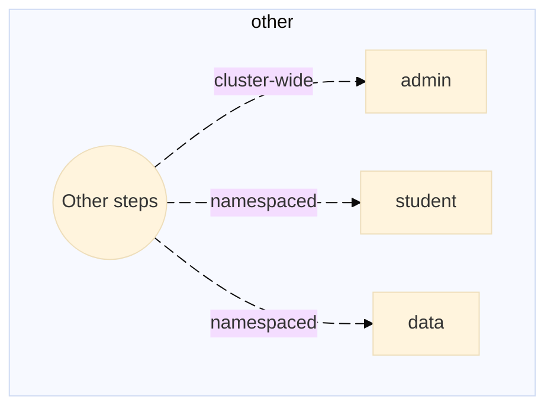

# Exercise 1 - First things first. Day-2 with SAP BTP, Kyma Runtime

The Kubernetes landscape lifecycle is divided into so-called routines or days, namely:
- Day-0 -- Planning and Design
- Day-1 -- Configuration and Deployment
- Day-2 -- Run and Operations with the focus on Observability/Monitoring (with the OpenTelemetry), Security and Governance, Developers experience (automation, CI/CD tools), Storage, High Availability


<table style="width: 100%; border-collapse: collapse; background-color: #f5f5f5;" border="1">
<tbody>
<tr style="height: 193px;">
<td style="width: 71.6%; height: 193px;">
<div> 
Day-2 Operations include: Management, Maintenance, Monitoring, and Optimization


</div>
</td>
</tr>
</tbody>
</table> 


> [!IMPORTANT]
> * With the SAP managed kubernetes the entire kubernetes infrastructure is managed 24/7 by the SAP SRE teams. That includes kubernetes versions updates, security patches, overall monitoring of the underlying infrastructure, etc.  
> * Customers can decide themselves to upsize or downsize the kubernetes cluster resources via a change of machine types.  
> * All SAP Kyma kubernetes extensions - the kyma modules are fully managed and supported as well. Customer have a choice between the fast and the regular channels with regard to the modules.  
> - The fast channel offer a 14-day trial window before the regular channel modules get promoted.
> - SAP L1 /L2 /L3 support teams are there to assist on request with the customers Day-2 operations via SAP support incidents management.
>
> - With this, the customers Day-2 operations teams can focus on Management, Maintenance, Monitoring, and Optimization of the customer workloads.


## Exercise 1.1 - Easy access to your teched landscape with SSO.

- This SAP Workzone dashboard is to assist you with the landscape discovery and ease the navigation thorugh the landscape components.
- Please use your allocated student's credentials to login...

<table style="width: 100%; border-collapse: collapse; background-color: #f5f5f5;" border="1">
<tbody>
<tr style="height: 193px;">
<td style="width: 71.6%; height: 193px;">
<div> 
<h1><a href="https://url.sap/3kf0ol"></a></h1>
</div>
</td>
</tr>
</tbody>
</table>   
  

## Exercise 1.2 - Built-in github actions automation flows

Does one always need to climb the mountain of the onboarding documentation? Not necessarily.  
A well-thought and designed landscape (Day-0/Day-1) would offer some built-in automation.  
Good to know:  
- This landscape features a number of pre-configured CI/CD github action workflows and Terraform automations.
- The workflows templates have been automatically generated by the Day-1 landscape
- The Day-2 teams have a solid set of automated worfklows to build upon their Day-2/SRE operationas

In this exercise you will:  
- 👉 Explore Kyma runtime environments with the built-in automation flows.  
- 👉 Retrieve the key information about the state of the runtime environment... at a glance.  
- 👉 Both securely and effortlessly!


The pre-configured CI/CD automation workflows are to be manually triggered. 
They come in three different flavors, namely as:
* admin workflows (cluster-wide) 
* students workflows (namespaced)   
* data collection workflows (namespaced).

<!-- 

<table>
<tr>
<td> Github automation workflow </td> <td> Sequence diagram </td>
</tr>
<tr>
<td> 👉 Let's have a look at the common building blocks (steps) of a github action workflow </td>
<td>
<div>

 


</div>
</td>
</tr>
<tr>
<td> other steps </td>
<td>
 
```mermaid
---
config:
  theme: base
  look: classic
---
flowchart TD
    F{"Other steps"} -- "cluster-wide" -> G["admin"]
    F -- namespaced -> H["student"] & I["Diagnostic"]
```

</td>
</tr>
</table>

--->

<table style="width: 100%; max-width:100%; table-layout: fixed; overflow:auto; border-collapse: collapse; background-color: #f5f5f5;" border="1">
<tbody>
<tr style="height: 193px;">
<td style="width: 71.6%; height: 193px;">
<div>
👉 Github automation workflows sequence diagrams. Let's have a look at the common building blocks (steps) of a github action workflow

<p float="left">  


<hr>
👉 Let's have a look at the other steps of a github action workflow




</p>
</div>
</td>
</tr>
</tbody>
</table> 

Time to do it yourself...  
- 👉 Pick a region and action of your choice...
- 👉 Trigger the workflow...(hint: you may run them all at once in parallel)
- 👉 Inspect the steps of each workflow...

<table style="width: 100%; border-collapse: collapse; background-color: #f5f5f5;" border="1">
<tbody>
<tr style="height: 193px;">
<td style="width: 71.6%; height: 193px;">

<div>


</div>
<hr>
<div>

👉 For the best experience, open workflow links into a separate tab or into a new window (right click).  


| Kyma BTP Region (Cockpit) |  Kyma dashboard | Admin Worklow (cluster-wide) | Student Workflow (namespaced)| Data Collection Workflow (namespaced)
| :---------  | --------- | :--------- | :------- | -----------
| [uk-south](https://emea.cockpit.btp.cloud.sap/cockpit?idp=anuk8cmfw.accounts.ondemand.com#/globalaccount/c1f19148-71f7-4883-9f86-8d5ee7634dec/subaccount/4457fb7f-3296-40cf-b66b-aac3d9d4a2b2) | [](https://dashboard.kyma.cloud.sap/?kubeconfigID=6D0AF763-179E-4F84-8ED0-724B3C0C2C92) | [uk-south--admin](../../../../actions/workflows/uk-south-teched-7a69075f-7faf-4604-a62e-806648791dba.yml) | [uk-south--xp264](../../../../actions/workflows/uk-south-teched-7a69075f-7faf-4604-a62e-806648791dba-xp264.yml)| [ k8s-data-context-student](../../../../actions/workflows/k8s-data-context-student.yml)
| [japan-east](https://emea.cockpit.btp.cloud.sap/cockpit?idp=anuk8cmfw.accounts.ondemand.com#/globalaccount/c1f19148-71f7-4883-9f86-8d5ee7634dec/subaccount/cae18034-657b-478d-89f7-b802b8111cd0) | [](https://dashboard.kyma.cloud.sap/?kubeconfigID=79EB720B-2C16-4A7E-AA7F-108C4E3B7E98 ) | [japan-east--admin](../../../../actions/workflows/japan-east-teched-2a6fe480-ac84-4751-ad37-56ec2a493932.yml) | [japan-east--xp264](../../../../actions/workflows/japan-east-teched-2a6fe480-ac84-4751-ad37-56ec2a493932-xp264.yml) | [k8s-data-context-student](../../../../actions/workflows/k8s-data-context-student.yml)
| [us-east](https://emea.cockpit.btp.cloud.sap/cockpit?idp=anuk8cmfw.accounts.ondemand.com#/globalaccount/c1f19148-71f7-4883-9f86-8d5ee7634dec/subaccount/831741eb-0b10-4d2c-9feb-c49afec286f5) | [](https://dashboard.kyma.cloud.sap/?kubeconfigID=72A4A32B-0D0A-47DE-90C9-A65D52C8ADBE) | [us-east--admin](../../../../actions/workflows/btp-runtime-teched-dbe7346b-88da-430a-8777-4f6aa3e22b5e.yml) | [us-east--xp264](../../../../actions/workflows/btp-runtime-teched-dbe7346b-88da-430a-8777-4f6aa3e22b5e-xp264.yml) | [k8s-data-context-student](../../../../actions/workflows/k8s-data-context-student.yml)
| [xp264-000](https://emea.cockpit.btp.cloud.sap/cockpit?idp=anuk8cmfw.accounts.ondemand.com#/globalaccount/c1f19148-71f7-4883-9f86-8d5ee7634dec/subaccount/20b6061c-64aa-4397-bc01-df7348704173) | [](https://dashboard.kyma.cloud.sap/?kubeconfigID=B427F082-0D0C-4657-9D99-56629CC03CF6 ) | [xp264-000--admin](../../../../actions/workflows/xp264-000-teched-622af3fe-a2f5-4fdd-a05f-73e343aec2a5.yml) | [xp264-000--xp264](../../../../actions/workflows/xp264-000-teched-622af3fe-a2f5-4fdd-a05f-73e343aec2a5-xp264.yml) | [k8s-data-context-student](../../../../actions/workflows/k8s-data-context-student.yml)
| [uk-xp264]() | [](https://dashboard.kyma.cloud.sap/?kubeconfigID=0FD84322-535C-4047-89CE-47FC775938FC ) | [uk-xp264--admin](../../../../actions/workflows/uk-xp264-teched-76f46b5b-d9ab-486f-8e4f-12e1163af943.yml) | [uk-xp264--xp264](../../../../actions/workflows/uk-xp264-teched-76f46b5b-d9ab-486f-8e4f-12e1163af943-xp264.yml) | [k8s-data-context-student](../../../../actions/workflows/k8s-data-context-student.yml)


</div>  
</td>
</tr>
</tbody>
</table>  


Explanation. What has happened?
----------
- You have manually triggered the pre-configured CI/CD automation workflows.
- Workflows execution is divided into steps. Each step represents a dedicated task.
- Diagnostic data collection from kyma clusters is done using both Kyma CLI and with several Terraform providers, namely:
  * SAP BTP TF provider
  * kubernetes provider 
  * kubectl provider

👉 Inspect the steps of each of the worklow you have run, for instance:

<table style="width: 100%; border-collapse: collapse; background-color: #f5f5f5;" border="1">
<tbody>
<tr style="height: 193px;">
<td style="width: 71.6%; height: 193px;">
<div>
  - admin and students flows
<h1><a href="https://dashboard.kyma.cloud.sap/?kubeconfigID=79EB720B-2C16-4A7E-AA7F-108C4E3B7E98">
<p float="left">
  
  
   
   
</p>
</a></h1>
</div>

<div>
  - diagnostic data (namespaced) flow
<h1><a href="https://dashboard.kyma.cloud.sap/?kubeconfigID=79EB720B-2C16-4A7E-AA7F-108C4E3B7E98">
<p float="left">
  
   
   
</p>
</a></h1>
</div>

</td>
</tr>
</tbody>
</table> 

> [!IMPORTANT]
> Good to know:
> - The security is paramount!  
> - The automated workflows leverage the dynamic OIDC credentials with Github Actions acting as the OIDC token provider in the context of a running job.  
> - Thus, there is no need to have any static credentials or be compelled to use a vault.  
> - The implemented mechanism ensures the credentials are rotated automatically which makes it suitable for long running pipelines as well.  


> [!NOTE]
> **In a nutshell, the automation workflow offer the following features and benefits:**
>
>  - 🔐 built-in GitHub's OIDC token trust for secure authentication
>  - ⚙️ easy setup of your Kubernetes kubeconfig with a single or multiple cluster contexts
>  - 🚀 can run kubectl and helm commands in your workflow
>  - 🚀 can run kyma cli commands in your workflow
>  - 🚀 can run terraform automation flows in your workflow
>
> **Benefits:**
>
>  - ✅ No need to store Kubernetes credentials as secrets
>  - ✅ Enhanced security through short-lived tokens
>  - ✅ Automatic token rotation
>  - ✅ Fine-grained access control

📖 Learn more: [Using GitHub Actions OpenID Connect in Kubernetes](https://blogs.sap.com/2022/09/23/using-github-actions-openid-connect-in-kubernetes/)


Principal excercise takeaways:
- The automation workflows provide ease of use with the emphasis on both security and on lowering the cost of the run with the Day-2 operations
- The Day-1 auto-generated automation workflows templates facilitate the Day-2 operations and allow for targeted extensions of the built-in flows.

## Exercise 1.3 - Zoom on Kyma CLI (optional)

In a nutshell, Kyma CLI extends the capabilities of the ubiquitous kubectl CLI against a range of kyma specific features.  

> [!TIP]
> Good to know: 
> - It is already pre-installed on the teched laptops and can be used from either a terminal window or VSCode integrated terminal
> - It is also available out-of-the-box in the automation workflows prepared for this session.
> - It is available for [installation](https://github.com/marketplace/actions/setup-kyma-cli) in the github CI/CD pipelines from the [github actions marketplace](https://github.com/marketplace?query=kyma).  

> [!NOTE]
>
> 👉 run `kyma version`
> 
> ```
> Kyma-CLI Version: 3.2.0
> ```
>
> 👉 run `kyma -h`
> ~~~rust
> kyma -h     
> Use this command to manage Kyma modules and resources on a cluster.
>
> Usage:
>  kyma [command]
>
> Available Commands:
>  alpha       Groups command prototypes for which the API may still change
>  app         Manages applications on the Kubernetes cluster
>  completion  Generate the autocompletion script for the specified shell
>  function    A set of commands for managing Functions
>  help        Help about any command
>  module      Manages Kyma modules
>  version     Displays the version of Kyma CLI
>
> Flags:
>  -h, --help                    Help for the command
>      --kubeconfig string       Path to the Kyma kubeconfig file
>      --show-extensions-error   Prints a possible error when fetching extensions fails
>      --skip-extensions         Skip fetching extensions from the target Kyma environment
>
> Use "kyma [command] --help" for more information about a command.
> ~~~


- 👉 Please get familiar with the other *kyma cli* [commands](https://github.com/kyma-project/cli/tree/3.2.0/docs/user/gen-docs)... 

## Exercise 1.4 - Fire-fighter access to your kyma cluster

There are two ways to gain access to a kyma cluster in XP264 session landscape, namely:
- from a terminal window using the downloaded user OIDC kubeconfig with either `kubectl` and/or `kyma CLI`
- from within a github action diagnostic workflow with the embeded terraform automation (the preferred way)


The first method requires a kubectl oidc plugin (already pre-installed on the laptops) and cannot be performed in a headless context, for instance from a CI/CD pipeline or workflow.  

You can initially download the kubeconfig from one of the links below or directly from any SAP Kyma dashboard.  

* Here goes the table with the links to all btp and k8s resources...  

> [!NOTE]
> | Region (BTP Cockpit) | Kubeconfig (download) | Console (dashboard) | Admin Worklow (cluster-wide) | Student Workflow (namespaced) | Data Collection Workflow (cluster-wide)
> | :--------- | :---------:  | --------- | :--------- | :------- | -----------
> | [uk-south](https://emea.cockpit.btp.cloud.sap/cockpit?idp=anuk8cmfw.accounts.ondemand.com#/globalaccount/c1f19148-71f7-4883-9f86-8d5ee7634dec/subaccount/4457fb7f-3296-40cf-b66b-aac3d9d4a2b2) | https://url.sap/q9176k | [](https://dashboard.kyma.cloud.sap/?kubeconfigID=6D0AF763-179E-4F84-8ED0-724B3C0C2C92) | [uk-south--admin](../../../../actions/workflows/uk-south-teched-7a69075f-7faf-4604-a62e-806648791dba.yml) | [uk-south--xp264](../../../../actions/workflows/uk-south-teched-7a69075f-7faf-4604-a62e-806648791dba-xp264.yml)| [ k8s-data-context](../../../../actions/workflows/k8s-data-context-teched.yml)
> | [japan-east](https://emea.cockpit.btp.cloud.sap/cockpit?idp=anuk8cmfw.accounts.ondemand.com#/globalaccount/c1f19148-71f7-4883-9f86-8d5ee7634dec/subaccount/cae18034-657b-478d-89f7-b802b8111cd0) | https://url.sap/0nusi8 | [](https://dashboard.kyma.cloud.sap/?kubeconfigID=79EB720B-2C16-4A7E-AA7F-108C4E3B7E98 ) | [japan-east--admin](../../../../actions/workflows/japan-east-teched-2a6fe480-ac84-4751-ad37-56ec2a493932.yml) | [japan-east--xp264](../../../../actions/workflows/japan-east-teched-2a6fe480-ac84-4751-ad37-56ec2a493932-xp264.yml) | [k8s-data-context](../../../../actions/workflows/k8s-data-context-teched.yml)
> | [us-east](https://emea.cockpit.btp.cloud.sap/cockpit?idp=anuk8cmfw.accounts.ondemand.com#/globalaccount/c1f19148-71f7-4883-9f86-8d5ee7634dec/subaccount/831741eb-0b10-4d2c-9feb-c49afec286f5) | https://url.sap/57qy47 | [](https://dashboard.kyma.cloud.sap/?kubeconfigID=72A4A32B-0D0A-47DE-90C9-A65D52C8ADBE) | [us-east--admin](../../../../actions/workflows/btp-runtime-teched-dbe7346b-88da-430a-8777-4f6aa3e22b5e.yml) | [us-east--xp264](../../../../actions/workflows/btp-runtime-teched-dbe7346b-88da-430a-8777-4f6aa3e22b5e-xp264.yml) | [k8s-data-context](../../../../actions/workflows/k8s-data-context-teched.yml)
> | [xp264-000](https://emea.cockpit.btp.cloud.sap/cockpit?idp=anuk8cmfw.accounts.ondemand.com#/globalaccount/c1f19148-71f7-4883-9f86-8d5ee7634dec/subaccount/20b6061c-64aa-4397-bc01-df7348704173) | https://url.sap/jdleyl | [](https://dashboard.kyma.cloud.sap/?kubeconfigID=B427F082-0D0C-4657-9D99-56629CC03CF6 ) | [xp264-000--admin](../../../../actions/workflows/xp264-000-teched-622af3fe-a2f5-4fdd-a05f-73e343aec2a5.yml) | [xp264-000--xp264](../../../../actions/workflows/xp264-000-teched-622af3fe-a2f5-4fdd-a05f-73e343aec2a5-xp264.yml) | [k8s-data-context](../../../../actions/workflows/k8s-data-context-teched.yml)
> | [uk-xp264]() |https://url.sap/tyapw7 | [](https://dashboard.kyma.cloud.sap/?kubeconfigID=0FD84322-535C-4047-89CE-47FC775938FC ) | [uk-xp264--admin](../../../../actions/workflows/uk-xp264-teched-76f46b5b-d9ab-486f-8e4f-12e1163af943.yml) | [uk-xp264--xp264](../../../../actions/workflows/uk-xp264-teched-76f46b5b-d9ab-486f-8e4f-12e1163af943-xp264.yml) | [k8s-data-context](../../../../actions/workflows/k8s-data-context-teched.yml)

Good to know:  
- Relying on a user-OIDC kubeconfig is not very convenient due to the periodic redirects that may cause timeouts, even in a terminal window.

Practice:
- 👉 Create a permenent or temporary service account based kubeconfig (with uk-south)
- 👉 Choose the uk-south tile or click on the provided deep link

```
kyma alpha kubeconfig generate --serviceaccount kyma-cli-sa --clusterrole cluster-admin --namespace default --permanent  --kubeconfig ~/.kube/kubeconfig--garden-kyma--a896778-external.yaml
```
or

```
kyma alpha kubeconfig generate --serviceaccount kyma-cli-sa --clusterrole cluster-admin --namespace default --time 1h  --kubeconfig ~/.kube/kubeconfig--garden-kyma--a896778-external.yaml
```


```
apiVersion: v1
clusters:
- cluster:
    certificate-authority-data: LS0tLS1CRUdJTiBDRVJUSUZJQ0FURS0tLS0tCk1JSUQ1ekNDQWsrZ0F3SUJBZ0lSQUt3bWpnd1VwQTQ5Rkw2Mkp3Zm56Y2d3RFFZSktvWklodmNOQVFFTEJRQXcKRFRFTE1Ba0dBM2ovNzZqWjdXei9BQU9PT2pjUzZVUnRRY0tSellIckRlZlVGdVJXUEVxWkRXTmxBPT0KLS0tLS1FTkQgQ0VSVElGSUNBVEUtLS0tLQo=
    server: https://api.a896778.kyma.ondemand.com
  name: garden-kyma--a896778-external
contexts:
- context:
    cluster: garden-kyma--a896778-external
    namespace: default
    user: kyma-cli-sa
  name: garden-kyma--a896778-external
current-context: garden-kyma--a896778-external
kind: Config
preferences: {}
users:
- name: kyma-cli-sa
  user:
    token: eyJhbGciOiJSUzI1NiIsImtpZCI6IlRvQlNSVXRhekVNQWpLaE11SF9Ga0lrUUlCTG5ZQUV3dk9wc3Z5czJZR2MifQ.***
```


```
kyma alpha kubeconfig generate --serviceaccount kyma-cli-sa --clusterrole cluster-admin --namespace default --permanent  --kubeconfig ~/.kube/kubeconfig--garden-kyma--a896778-external.yaml > ~/.kube/kubeconfig--a896778.yaml


kyma alpha kubeconfig generate --serviceaccount xp264-000-sa  --namespace xp264-000 --permanent  --kubeconfig ~/.kube/kubeconfig--garden-kyma--a896778-external.yaml
```

  * read-only access in a given namespace

```
kyma alpha kubeconfig generate --serviceaccount kyma-cli-view-sa  --namespace default --permanent --clusterrole view --kubeconfig ~/.kube/kubeconfig--garden-kyma--a896778-external.yaml
```

  * cluster-wide read-only access

```
kyma alpha kubeconfig generate --serviceaccount kyma-cli-view-sa  --namespace default --permanent --clusterrole view --cluster-wide --kubeconfig ~/.kube/kubeconfig--garden-kyma--a896778-external.yaml


kyma alpha kubeconfig generate --serviceaccount xp264-000-sa  --namespace xp264-000 --permanent --clusterrole view --cluster-wide --kubeconfig ~/.kube/kubeconfig--garden-kyma--a896778-external.yaml
```  

Let's leverage the kyma cli to get simple metadata from a kyma cluster

👉 run `kyma alpha diagnose -f json | jq '.metadata'`
```
{
  "globalAccountID": "4c526f8b-cca9-4837-8b43-87824e3a4d10",
  "subaccountID": "5524c764-8893-4530-8eb8-feb9e6110f16",
  "clusterID": "eef5b822-8f8f-4d08-af05-f26aafe252b8",
  "clusterDomain": "a416537.stage.kyma.ondemand.com",
  "region": "uksouth",
  "shootName": "a416537",
  "provider": "azure",
  "kubernetesVersion": "1.33.3",
  "natGatewayIPs": [
    "172.167.242.76,",
    "172.187.130.162,",
    "172.187.211.228"
  ],
  "gardenerExtensions": [
    "shoot-auditlog-service",
    "shoot-cert-service",
    "shoot-dns-service",
    "shoot-lakom-service",
    "shoot-networking-filter",
    "shoot-networking-problemdetector",
    "shoot-oidc-service"
  ],
  "kubeAPIServer": "https://api.a416537.stage.kyma.ondemand.com"
}
```

  * Let's use the above information to build the deep link to the BTP subaccount with the kyma runtime environment.  
  * Use the link to inspect the BTP side of the kyma house....
  * Goto the [landscape dashboard](https://url.sap/3kf0ol) and choose the right environment...
  * Scramble the kyma runtime environment with the BTP Provisioning Service REST APIs

```
kyma alpha diagnose -f json | jq '.nodes[] | tojson'

"{\"machineInfo\":{\"name\":\"shoot--kyma-stage--a416537-cpu-worker-0-z1-69d94-hd29q\",\"architecture\":\"amd64\",\"kernelVersion\":\"6.12.47-cloud-amd64\",\"osImage\":\"Garden Linux 1877.4\",\"containerRuntime\":\"containerd://2.1.4\",\"kubeletVersion\":\"v1.33.3\",\"operatingSystem\":\"linux\"},\"capacity\":{\"cpu\":\"4\",\"memory\":\"16384092Ki\",\"eph
```


## Exercise 1.5 - Terraforming kyma runtime environment

Accessing other diagnostic information with btp and kubernetes terraform providers.

> [!NOTE]
> The built-in terraform automation is designed to use the very kyma cluster as its remote backend to persist the terraform state.  
> That's extremely convient as it allows to explore the gathered information at any time time and have it processed with other tools, etc...
> It could be, for instance, shared with the SAP Kyma support.


- 👉 Let's capitalize on the student diagnostic github action that provides a service account based kubeconfig as an artifact, as follows:


<table style="width: 100%; border-collapse: collapse; background-color: #f5f5f5;" border="1">
<tbody>
<tr style="height: 193px;">
<td style="width: 71.6%; height: 193px;">
<div> 
<h1><a href="https://url.sap/3kf0ol"></a></h1>
</div>
</td>
</tr>
</tbody>
</table> 


- 👉 run: `export KUBE_CONFIG_PATH=~/Downloads/kubeconfig_sa/my-kubeconfig_sa.yaml`
- 👉 run: `terraform workspace list`

```
│ Error: Backend initialization required, please run "terraform init"
│ 
│ Reason: Initial configuration of the requested backend "kubernetes"
│ 
│ The "backend" is the interface that Terraform uses to store state,
│ perform operations, etc. If this message is showing up, it means that the
│ Terraform configuration you're using is using a custom configuration for
│ the Terraform backend.
│ 
│ Changes to backend configurations require reinitialization. This allows
│ Terraform to set up the new configuration, copy existing state, etc. Please run
│ "terraform init" with either the "-reconfigure" or "-migrate-state" flags to
│ use the current configuration.
│ 
│ If the change reason above is incorrect, please verify your configuration
│ hasn't changed and try again. At this point, no changes to your existing
│ configuration or state have been made.
╵
```

- 👉 run: `terraform init`

```       
Initializing the backend...

Successfully configured the backend "kubernetes"! Terraform will automatically
use this backend unless the backend configuration changes.
Initializing modules...
- k8s_context in modules/k8s
Initializing provider plugins...
- Finding latest version of massdriver-cloud/jq...
- Finding salrashid123/http-full versions matching "1.3.1"...
- Finding latest version of hashicorp/kubernetes...
- Finding latest version of alekc/kubectl...
- Finding latest version of hashicorp/local...
- Finding latest version of hashicorp/http...
- Finding latest version of jackivanov/qrcode...
- Finding latest version of sap/btp...
- Installing hashicorp/local v2.5.3...
- Installed hashicorp/local v2.5.3 (signed by HashiCorp)
- Installing hashicorp/http v3.5.0...
- Installed hashicorp/http v3.5.0 (signed by HashiCorp)
- Installing jackivanov/qrcode v1.0.0...
- Installed jackivanov/qrcode v1.0.0 (self-signed, key ID 13FBA8C4DFF15EE4)
- Installing sap/btp v1.17.0...
- Installed sap/btp v1.17.0 (self-signed, key ID 270FEB6EE486FEBF)
- Installing massdriver-cloud/jq v0.2.1...
- Installed massdriver-cloud/jq v0.2.1 (self-signed, key ID 6758F1FC1D4FE114)
- Installing salrashid123/http-full v1.3.1...
- Installed salrashid123/http-full v1.3.1 (self-signed, key ID 97341836616BF511)
- Installing hashicorp/kubernetes v2.38.0...
- Installed hashicorp/kubernetes v2.38.0 (signed by HashiCorp)
- Installing alekc/kubectl v2.1.3...
- Installed alekc/kubectl v2.1.3 (self-signed, key ID 772FB27A86DAFCE7)
Partner and community providers are signed by their developers.
If you'd like to know more about provider signing, you can read about it here:
https://www.terraform.io/docs/cli/plugins/signing.html
Terraform has created a lock file .terraform.lock.hcl to record the provider
selections it made above. Include this file in your version control repository
so that Terraform can guarantee to make the same selections by default when
you run "terraform init" in the future.

Terraform has been successfully initialized!

You may now begin working with Terraform. Try running "terraform plan" to see
any changes that are required for your infrastructure. All Terraform commands
should now work.

If you ever set or change modules or backend configuration for Terraform,
rerun this command to reinitialize your working directory. If you forget, other
commands will detect it and remind you to do so if necessary.
```

- 👉 run: `terraform workspace list`
```
* default
  k8s-context-xp264-050-c1f19148-71f7-4883-9f86-8d5ee7634dec
  k8s-context-xp264-050-xp264-050
```

- 👉 run: `terraform workspace select k8s-context-xp264-050-xp264-050`
`Switched to workspace "k8s-context-xp264-050-xp264-050".`


- 👉 run: `terraform output`
```
KymaModules = [
  {
    "api" = "operator.kyma-project.io/v1alpha1"
    "channel" = "regular"
    "fqdn" = "kyma-project.io/module/api-gateway"
    "name" = "api-gateway"
    "state" = "Ready"
    "version" = "3.2.3"
  },
  {
    "api" = "operator.kyma-project.io/v1alpha2"
    "channel" = "regular"
    "fqdn" = "kyma-project.io/module/istio"
    "name" = "istio"
    "state" = "Ready"
    "version" = "1.22.1"
  },
  {
    "api" = "operator.kyma-project.io/v1alpha1"
    "channel" = "regular"
    "fqdn" = "kyma-project.io/module/btp-operator"
    "name" = "btp-operator"
    "state" = "Ready"
    "version" = "1.2.19"
  },
  {
    "api" = "operator.kyma-project.io/v1alpha1"
    "channel" = "regular"
    "fqdn" = "kyma-project.io/module/serverless"
    "name" = "serverless"
    "state" = "Ready"
    "version" = "1.8.4"
  },
  {
    "api" = "connectivityproxy.sap.com/v1"
    "channel" = "regular"
    "fqdn" = "kyma-project.io/module/connectivity-proxy"
    "name" = "connectivity-proxy"
    "state" = "Ready"
    "version" = "1.1.2"
  },
  {
    "api" = "operator.kyma-project.io/v1alpha1"
    "channel" = "regular"
    "fqdn" = "kyma-project.io/module/keda"
    "name" = "keda"
    "state" = "Ready"
    "version" = "1.8.2"
  },
  {
    "api" = "operator.kyma-project.io/v1alpha1"
    "channel" = "regular"
    "fqdn" = "kyma-project.io/module/transparent-proxy"
    "name" = "transparent-proxy"
    "state" = "Ready"
    "version" = "1.8.8"
  },
  {
    "api" = "operator.kyma-project.io/v1alpha1"
    "channel" = "regular"
    "fqdn" = "kyma-project.io/module/telemetry"
    "name" = "telemetry"
    "state" = "Ready"
    "version" = "1.49.0"
  },
]
```

- 👉 Run the Data Collection Workflow


<table style="width: 100%; border-collapse: collapse; background-color: #f5f5f5;" border="1">
<tbody>
<tr style="height: 193px;">
<td style="width: 71.6%; height: 193px;">

<div>


</div>

<div>

👉 For the best experience, open workflow links into a separate tab or into a new window (right click).  

| Kyma BTP Region (Cockpit) |  Kyma dashboard | Admin Worklow (cluster-wide) | Student Workflow (namespaced)| Data Collection Workflow (namespaced)
 | :---------  | --------- | :--------- | :------- | -----------
 | [uk-south](https://emea.cockpit.btp.cloud.sap/cockpit?idp=anuk8cmfw.accounts.ondemand.com#/globalaccount/c1f19148-71f7-4883-9f86-8d5ee7634dec/subaccount/4457fb7f-3296-40cf-b66b-aac3d9d4a2b2) | [](https://dashboard.kyma.cloud.sap/?kubeconfigID=6D0AF763-179E-4F84-8ED0-724B3C0C2C92) | [uk-south--admin](../../../../actions/workflows/uk-south-teched-7a69075f-7faf-4604-a62e-806648791dba.yml) | [uk-south--xp264](../../../../actions/workflows/uk-south-teched-7a69075f-7faf-4604-a62e-806648791dba-xp264.yml)| [ k8s-data-context-student](../../../../actions/workflows/k8s-data-context-student.yml)
 | [japan-east](https://emea.cockpit.btp.cloud.sap/cockpit?idp=anuk8cmfw.accounts.ondemand.com#/globalaccount/c1f19148-71f7-4883-9f86-8d5ee7634dec/subaccount/cae18034-657b-478d-89f7-b802b8111cd0) | [](https://dashboard.kyma.cloud.sap/?kubeconfigID=79EB720B-2C16-4A7E-AA7F-108C4E3B7E98 ) | [japan-east--admin](../../../../actions/workflows/japan-east-teched-2a6fe480-ac84-4751-ad37-56ec2a493932.yml) | [japan-east--xp264](../../../../actions/workflows/japan-east-teched-2a6fe480-ac84-4751-ad37-56ec2a493932-xp264.yml) | [k8s-data-context-student](../../../../actions/workflows/k8s-data-context-student.yml)
 | [us-east](https://emea.cockpit.btp.cloud.sap/cockpit?idp=anuk8cmfw.accounts.ondemand.com#/globalaccount/c1f19148-71f7-4883-9f86-8d5ee7634dec/subaccount/831741eb-0b10-4d2c-9feb-c49afec286f5) | [](https://dashboard.kyma.cloud.sap/?kubeconfigID=72A4A32B-0D0A-47DE-90C9-A65D52C8ADBE) | [us-east--admin](../../../../actions/workflows/btp-runtime-teched-dbe7346b-88da-430a-8777-4f6aa3e22b5e.yml) | [us-east--xp264](../../../../actions/workflows/btp-runtime-teched-dbe7346b-88da-430a-8777-4f6aa3e22b5e-xp264.yml) | [k8s-data-context-student](../../../../actions/workflows/k8s-data-context-student.yml)
 | [xp264-000](https://emea.cockpit.btp.cloud.sap/cockpit?idp=anuk8cmfw.accounts.ondemand.com#/globalaccount/c1f19148-71f7-4883-9f86-8d5ee7634dec/subaccount/20b6061c-64aa-4397-bc01-df7348704173) | [](https://dashboard.kyma.cloud.sap/?kubeconfigID=B427F082-0D0C-4657-9D99-56629CC03CF6 ) | [xp264-000--admin](../../../../actions/workflows/xp264-000-teched-622af3fe-a2f5-4fdd-a05f-73e343aec2a5.yml) | [xp264-000--xp264](../../../../actions/workflows/xp264-000-teched-622af3fe-a2f5-4fdd-a05f-73e343aec2a5-xp264.yml) | [k8s-data-context-student](../../../../actions/workflows/k8s-data-context-student.yml)
 | [uk-xp264]() | [](https://dashboard.kyma.cloud.sap/?kubeconfigID=0FD84322-535C-4047-89CE-47FC775938FC ) | [uk-xp264--admin](../../../../actions/workflows/uk-xp264-teched-76f46b5b-d9ab-486f-8e4f-12e1163af943.yml) | [uk-xp264--xp264](../../../../actions/workflows/uk-xp264-teched-76f46b5b-d9ab-486f-8e4f-12e1163af943-xp264.yml) | [k8s-data-context-student](../../../../actions/workflows/k8s-data-context-student.yml)


</div>  
</td>
</tr>
</tbody>
</table>  


## Exercise 1.6 - Subscribe to a kyma multitenant application

Here goes a diagram of the functional architecture of the solution

<table style="width: 100%; border-collapse: collapse; background-color: #f5f5f5;" border="1">
<tbody>
<tr style="height: 193px;">
<td style="width: 71.6%; height: 193px;">
<div>
<h1><a href="https://url.sap/3kf0ol"></a></h1>
</div>
</td>
</tr>
</tbody>
</table>   


👉 In order to subscribe or to retrieve an existing subscription for your session user (xp264-0xx) run the following github action: 

| Run Subscription workflow | Retrieve the subscription URL | Retrieve the consumer tenant URL
| -------- | ------------- | ----------
[teched-xp264-mt](../../../../actions/workflows/teched-xp264-mt.yml) | [subscription URL](https://mt-xp264-050-teched-21270afd.b84edf3.kyma.ondemand.com) | [consumer tenant URL](https://emea.cockpit.btp.cloud.sap/cockpit?idp=anuk8cmfw.accounts.ondemand.com#/globalaccount/c1f19148-71f7-4883-9f86-8d5ee7634dec/subaccount/71e400a1-dfab-4d6f-a4a3-890ea7ae6eab)


<table style="width: 100%; border-collapse: collapse; background-color: #f5f5f5;" border="1">
<tbody>
<tr style="height: 193px;">
<td style="width: 71.6%; height: 193px;">
<div>
<h1><a href="https://mt-xp264-001-teched-80a5defe.b84edf3.kyma.ondemand.com">
<p float="left">
  
  
   
</p>
</a></h1>
</div>
</td>
</tr>
</tbody>
</table> 


<table style="width: 100%; border-collapse: collapse; background-color: #f5f5f5;" border="1">
<tbody>
<tr style="height: 193px;">
<td style="width: 71.6%; height: 193px;">
<div>
<h1><a href="https://mt-xp264-001-teched-80a5defe.b84edf3.kyma.ondemand.com">
<p float="left">
   
</p>
</a></h1>
</div>
</td>
</tr>
</tbody>
</table> 

Good to know:
- There is a single subscription in each consumer tenant (a BTP subaccount)
- All students users as a group can access every subscription in each consumer tenant...
- However, the access to the subscribed app is SSO-ringfenced...
- All the subsciptions can be viewed from the subscription dashboard on the provider side...
- The workflow can be used to unsubscribe. If you choose to do it, please make sure you use the allocated students name.


- If this happens to be a first time subscription, please let me go the consumer tenant and disable the SAP IDS for user logon, as depicted below:

<table style="width: 100%; border-collapse: collapse; background-color: #f5f5f5;" border="1">
<tbody>
<tr style="height: 193px;">
<td style="width: 71.6%; height: 193px;">
<div>
<h1><a href="https://emea.cockpit.btp.cloud.sap/cockpit?idp=anuk8cmfw.accounts.ondemand.com#/globalaccount/c1f19148-71f7-4883-9f86-8d5ee7634dec/subaccount/1e722e67-9ec2-46de-a690-9a89e7a066ce">
<p float="left">
  
  
   
</p>
</a></h1>
</div>
</td>
</tr>
</tbody>
</table> 

- Please observe the consumer context is very much empty. The consumer subaccount acts as a service provider ensuring user authentication and permissions validation in order to access the subscription.


<table style="width: 100%; border-collapse: collapse; background-color: #f5f5f5;" border="1">
<tbody>
<tr style="height: 193px;">
<td style="width: 71.6%; height: 193px;">
<div>
<h1><a href="">
<p float="left">
  
  
   
</p>
</a></h1>
</div>
</td>
</tr>
</tbody>
</table> 

## Summary


Continue to - [Exercise 2 - Use External Scalers. Keda](../ex2/README.md)

