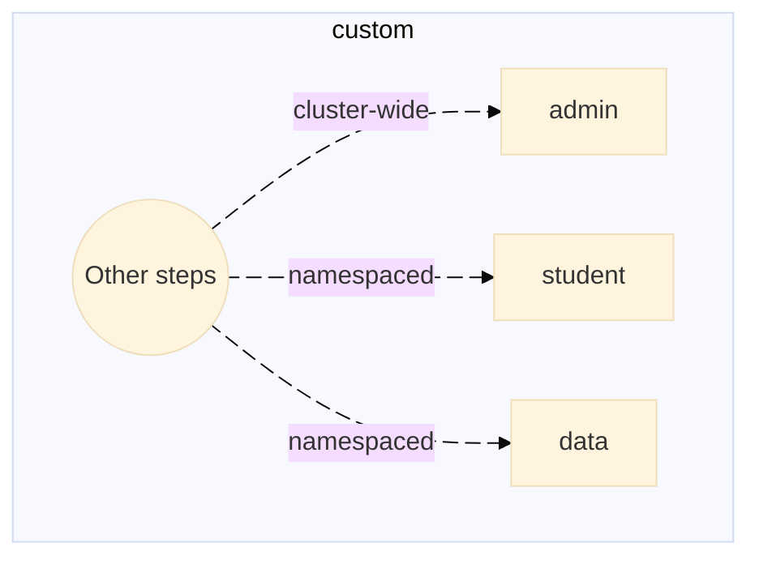

# Exercise 1 - First things first. Day-2 with SAP BTP, Kyma Runtime

Day 2 Operations refers to the ongoing operational activities required to maintain, monitor, and optimize systems after the initial deployment (Day 1 - Configuration and Deployment).   


<table style="width: 100%; border-collapse: collapse; background-color: #f5f5f5;" border="1">
<tbody>
<tr style="height: 193px;">
<td style="width: 71.6%; height: 193px;">
<div> 
Summary of the routines or days:  

- Day-0 -- Planning and Design
- Day-1 -- Configuration and Deployment
- Day-2 -- Run and Operations with the focus on Observability/Monitoring (with the OpenTelemetry), Security and Governance, Developers experience (automation, CI/CD tools), Storage, High Availability

<hr>

- The below charts provide different perspectives on Day 2 operations - from process flow to timeline-based activities.


</div>

- Timeline-based activities.

<div>


</div>
</td>
</tr>
</tbody>
</table> 


> [!IMPORTANT]
> * With the SAP managed kubernetes offering, the entire kubernetes infrastructure is managed 24/7 by the SAP SRE teams. That includes regular kubernetes versions updates, security patches, overall monitoring of the underlying infrastructure, etc. 
> * Customers can decide by themselves to upsize or downsize the kubernetes cluster resources via a change of machine types.  In order to optimize the cluster configuration and resources, additional worker pools can be provisioned/deprovisioned as well. These worker pools may feature nodes sizes (machine types) different from the master cluster nodes. Worker pools with GPU nodes are supported as well.
> * All SAP Kyma kubernetes extensions - the kyma modules - are fully managed and supported. Customer have a choice between the fast and the regular channels with regard to the modules.  
The fast channel offers a 14-day trial window before the modules get promoted to the regular channel.
> * [What's new channel](https://help.sap.com/whats-new/cf0cb2cb149647329b5d02aa96303f56?Environment=Kyma;Kubernetes&Component=Kyma+Runtime) with all the kyma runtime past, current and future changes - this information channel can be subscribed to.
> * SAP L1 /L2 /L3 /SRE support teams are there to assist on request with the customers Day-2 operations via SAP support channel.
>
> * With this, the customers Day-2 operations teams may focus exclusively on Management, Maintenance, Monitoring, and Optimization of their own workloads rather.


## Exercise 1.1 - Easy access to your teched landscape with SSO.

- This SAP Workzone dashboard is to assist you with the landscape discovery and ease the navigation thorugh the landscape components.
- Please use your allocated student's credentials to login...

<table style="width: 100%; border-collapse: collapse; background-color: #f5f5f5;" border="1">
<tbody>
<tr style="height: 193px;">
<td style="width: 71.6%; height: 193px;">
<div> 
<h1><a href="https://url.sap/3kf0ol"></a></h1>
</div>
</td>
</tr>
</tbody>
</table>   
  

## Exercise 1.2 - Built-in github actions automation flows

Does one always need to climb the mountain of the onboarding documentation? Not necessarily.  
A well-thought and designed landscape (Day-0/Day-1) would offer some built-in automation.  
Good to know:  
- This landscape features a number of pre-configured CI/CD github action workflows and Terraform automations.
- The workflows templates have been automatically generated by the Day-1 landscape
- The Day-2 teams have a solid set of automated worfklows to build upon their Day-2/SRE operationas

In this exercise you will:  
- 👉 Explore Kyma runtime environments with the built-in automation flows.  
- 👉 Retrieve the key information about the state of the runtime environment... at a glance.  
- 👉 Both securely and effortlessly!


The pre-configured CI/CD automation workflows are to be manually triggered. 
They come in three different flavors, namely as:
* admin workflows (cluster-wide) 
* students workflows (namespaced)   
* data collection workflows (namespaced).

<table style="width: 100%; max-width:100%; table-layout: fixed; overflow:auto; border-collapse: collapse; background-color: #f5f5f5;" border="1">
<tbody>
<tr style="height: 193px;">
<td style="width: 71.6%; height: 193px;">
<div>
👉 Github automation workflows sequence diagrams. Let's have a look at the common building blocks (steps) of a github action workflow
<hr>

<p float="left">  


<hr>
👉 Let's have a look at the custom steps of a github action workflow




</p>
</div>
</td>
</tr>
</tbody>
</table> 

Practice:   
- 👉 Pick a region and action of your choice...
- 👉 Trigger the workflow...(hint: you may run them all at once in parallel)
- 👉 Inspect the steps of each workflow...

<table style="width: 100%; border-collapse: collapse; background-color: #f5f5f5;" border="1">
<tbody>
<tr style="height: 193px;">
<td style="width: 71.6%; height: 193px;">

<div>


</div>
<hr>
<div>

👉 For the best experience, open workflow links into a separate tab or into a new window (right click).  


| Kyma BTP Region (Cockpit) |  Kyma dashboard | Admin Worklow (cluster-wide) | Student Workflow (namespaced)| Data Collection Workflow (namespaced)
| :---------  | --------- | :--------- | :------- | -----------
| [uk-south](https://url.sap/0dd8pm) | [](https://url.sap/x2ygbf) | [uk-south--admin](../../../../actions/workflows/uk-south-teched-7a69075f-7faf-4604-a62e-806648791dba.yml) | [uk-south--xp264](../../../../actions/workflows/uk-south-teched-7a69075f-7faf-4604-a62e-806648791dba-xp264.yml)| [ k8s-data-context-student](../../../../actions/workflows/k8s-data-context-student.yml)
| [japan-east](https://url.sap/u66itn) | [](https://url.sap/0ysrs1 ) | [japan-east--admin](../../../../actions/workflows/japan-east-teched-2a6fe480-ac84-4751-ad37-56ec2a493932.yml) | [japan-east--xp264](../../../../actions/workflows/japan-east-teched-2a6fe480-ac84-4751-ad37-56ec2a493932-xp264.yml) | [k8s-data-context-student](../../../../actions/workflows/k8s-data-context-student.yml)
| [us-east](https://url.sap/b24wtp) | [](https://url.sap/ui217f) | [us-east--admin](../../../../actions/workflows/btp-runtime-teched-dbe7346b-88da-430a-8777-4f6aa3e22b5e.yml) | [us-east--xp264](../../../../actions/workflows/btp-runtime-teched-dbe7346b-88da-430a-8777-4f6aa3e22b5e-xp264.yml) | [k8s-data-context-student](../../../../actions/workflows/k8s-data-context-student.yml)
| [xp264-000](https://url.sap/v2dn5g) | [](https://url.sap/9waari ) | [xp264-000--admin](../../../../actions/workflows/xp264-000-teched-622af3fe-a2f5-4fdd-a05f-73e343aec2a5.yml) | [xp264-000--xp264](../../../../actions/workflows/xp264-000-teched-622af3fe-a2f5-4fdd-a05f-73e343aec2a5-xp264.yml) | [k8s-data-context-student](../../../../actions/workflows/k8s-data-context-student.yml)
| [uk-xp264](https://url.sap/ovbfn6) | [](https://url.sap/3wchu2 ) | [uk-xp264--admin](../../../../actions/workflows/uk-xp264-teched-76f46b5b-d9ab-486f-8e4f-12e1163af943.yml) | [uk-xp264--xp264](../../../../actions/workflows/uk-xp264-teched-76f46b5b-d9ab-486f-8e4f-12e1163af943-xp264.yml) | [k8s-data-context-student](../../../../actions/workflows/k8s-data-context-student.yml)


</div>  
</td>
</tr>
</tbody>
</table>  


Explanation. What has happened?
----------
- You have manually triggered the pre-configured CI/CD automation workflows.
- Workflows execution is divided into steps. Each step represents a dedicated task.
- Diagnostic data collection from kyma clusters is done using both Kyma CLI and with several Terraform providers, namely:
  * SAP BTP TF provider
  * kubernetes provider 
  * kubectl provider

👉 Inspect the steps of each of the worklow you have run, for instance:

<table style="width: 100%; border-collapse: collapse; background-color: #f5f5f5;" border="1">
<tbody>
<tr style="height: 193px;">
<td style="width: 71.6%; height: 193px;">
<div>
  - admin and students flows
<h1><a href="https://url.sap/0ysrs1">
<p float="left">
  
  
   
   
</p>
</a></h1>
</div>

<div>
  - diagnostic data (namespaced) flow
<h1><a href="https://url.sap/0ysrs1">
<p float="left">
  
   
   
</p>
</a></h1>
</div>

</td>
</tr>
</tbody>
</table> 

> [!IMPORTANT]
> Good to know:
> - The security is paramount!  
> - The automated workflows leverage the dynamic OIDC credentials with Github Actions acting as the OIDC token provider in the context of a running job.  
> - Thus, there is no need to have any static credentials or be compelled to use a vault.  
> - The implemented mechanism ensures the credentials are rotated automatically which makes it suitable for long running pipelines as well.  


> [!NOTE]
> **In a nutshell, the automation workflow offer the following features and benefits:**
>
>  - 🔐 built-in GitHub's OIDC token trust for secure authentication
>  - ⚙️ easy setup of your Kubernetes kubeconfig with a single or multiple cluster contexts
>  - 🚀 can run kubectl and helm commands in your workflow
>  - 🚀 can run kyma cli commands in your workflow
>  - 🚀 can run terraform automation flows in your workflow
>
> **Benefits:**
>
>  - ✅ No need to store Kubernetes credentials as secrets
>  - ✅ Enhanced security through short-lived tokens
>  - ✅ Automatic token rotation
>  - ✅ Fine-grained access control

📖 Learn more: [Using GitHub Actions OpenID Connect in Kubernetes](https://blogs.sap.com/2022/09/23/using-github-actions-openid-connect-in-kubernetes/)


## Exercise 1.3 - Zoom on Kyma CLI (optional)

In a nutshell, Kyma CLI extends the capabilities of the ubiquitous kubectl CLI against a range of kyma specific features.  

> [!TIP]
> Good to know: 
> - It is already pre-installed on the teched laptops and can be used from either a terminal window or VSCode integrated terminal
> - It is also available out-of-the-box in the automation workflows prepared for this session.
> - It is available for [installation](https://github.com/marketplace/actions/setup-kyma-cli) in the github CI/CD pipelines from the [github actions marketplace](https://github.com/marketplace?query=kyma).  

> [!NOTE]
>
> 👉 run `kyma version`
> 
> ```
> Kyma-CLI Version: 3.2.0
> ```
>
> 👉 run `kyma -h`
> ~~~rust
> kyma -h     
> Use this command to manage Kyma modules and resources on a cluster.
>
> Usage:
>  kyma [command]
>
> Available Commands:
>  alpha       Groups command prototypes for which the API may still change
>  app         Manages applications on the Kubernetes cluster
>  completion  Generate the autocompletion script for the specified shell
>  function    A set of commands for managing Functions
>  help        Help about any command
>  module      Manages Kyma modules
>  version     Displays the version of Kyma CLI
>
> Flags:
>  -h, --help                    Help for the command
>      --kubeconfig string       Path to the Kyma kubeconfig file
>      --show-extensions-error   Prints a possible error when fetching extensions fails
>      --skip-extensions         Skip fetching extensions from the target Kyma environment
>
> Use "kyma [command] --help" for more information about a command.
> ~~~

Practice:

> [!NOTE]
> - 👉 Let's leverage the kyma cli to get simple metadata from a kyma cluster...  
> - 👉 run `kyma alpha diagnose -f json | jq '.metadata'`
>
> ~~~rust
> {
>  "globalAccountID": "4c526f8b-cca9-4837-8b43-87824e3a4d10",
>  "subaccountID": "5524c764-8893-4530-8eb8-feb9e6110f16",
> ............
> }
> ~~~
> Practice:
> - 👉 run and explore `kyma alpha diagnose -f json | jq '.nodes[] | tojson'`

> [!TIP]
>  * Let's use the above information to build the deep link to the BTP subaccount with the kyma runtime environment.  
>  * Use the link to inspect the BTP side of the kyma house....
>  * Goto the [landscape dashboard](https://url.sap/3kf0ol) and choose the right environment...
>  * Scramble the kyma runtime environment with the BTP Provisioning Service REST APIs


- 👉 Last but not least, get familiar with the other *kyma cli* [commands](https://github.com/kyma-project/cli/tree/3.2.0/docs/user/gen-docs)... 

## Exercise 1.4 - Fire-fighter access to your kyma cluster

As usual, in case of fire, one needs well designated escape routes!  

There are mutliple ways to gain access to a kyma cluster in XP264 session landscape, namely:
- from a kyma dashboard (console)
- from a terminal window using the downloaded user OIDC kubeconfig with either `kubectl` and/or `kyma CLI`
- from within a github action diagnostic workflow that comprises the embeded terraform automation (the preferred way)


The first two methods require a kubectl oidc plugin and cannot be performed in a headless context, for instance in a CI/CD pipeline or workflow.  

<!-- > [!NOTE]
>
> * For convenience, here goes the table with the links to all btp and k8s resources...  
> * You can initially download the kubeconfig from one of the links below or directly from any SAP Kyma dashboard.  
>
> | Region (BTP Cockpit) | Kubeconfig (download) | Console (dashboard)
> | :--------- | :---------:  | --------- | 
> | [uk-south](https://url.sap/0dd8pm) | https://url.sap/q9176k | [](https://url.sap/x2ygbf) 
> | [japan-east](https://url.sap/u66itn) | https://url.sap/0nusi8 | [](https://url.sap/0ysrs1 ) 
> | [us-east](https://url.sap/b24wtp) | https://url.sap/57qy47 | [](https://url.sap/ui217f) 
> | [xp264-000](https://url.sap/v2dn5g) | https://url.sap/jdleyl | [](https://url.sap/9waari ) 
> | [uk-xp264](https://url.sap/ovbfn6) |https://url.sap/tyapw7 | [](https://url.sap/3wchu2 ) 
 -->

> [!TIP]
> 
> - Relying on a user-OIDC kubeconfig is not very convenient due to the periodic redirects that may cause timeouts, even if used in a terminal window.

Practice:  
👉 Explore:  
- Permanent and time-boxed both namespaced and cluster wide full admin access.  
- Permanent and time-boxed both namespaced and cluster wide read-only access.


| Run Firefighter student workflow |
| -------- | 
[k8s-fire-fighter-student](../../../../actions/workflows/k8s-fire-fighter-student.yml) 


<table style="width: 100%; border-collapse: collapse; background-color: #f5f5f5;" border="1">
<tbody>
<tr style="height: 193px;">
<td style="width: 71.6%; height: 193px;">
<div> 
<h1><a href="../../../../actions/workflows/k8s-fire-fighter-student.yml"></a></h1>
</div>
</td>
</tr>
</tbody>
</table> 

👉 Download the artifacts and upload them into an empty [kyma dashboard](https://dashboard.kyma.cloud.sap/clusters)  
👉 Take a note of the kyma cluster region and your namespace  

<table style="width: 100%; border-collapse: collapse; background-color: #f5f5f5;" border="1">
<tbody>
<tr style="height: 193px;">
<td style="width: 71.6%; height: 193px;">
<div> 
<h1><a href="../../../../actions/workflows/k8s-fire-fighter-student.yml"></a></h1>
</div>
<div> 
<h1><a href="https://dashboard.kyma.cloud.sap/clusters"></a></h1>
</div>
</td>
</tr>
</tbody>
</table> 

## Exercise 1.5 - Terraforming kyma runtime environment


<table style="width: 100%; border-collapse: collapse; background-color: #f5f5f5;" border="1">
<tbody>
<tr style="height: 193px;">
<td style="width: 71.6%; height: 193px;">

<div>

<h4>Accessing other diagnostic information with btp and kubernetes terraform providers....</h4>


</div>

> [!NOTE]
> The built-in terraform automation is designed to use the very kyma cluster as its remote backend to persist the terraform state.  
> That's extremely convient as it allows to explore the gathered information at any time time and have it processed with other tools, etc...  
> It could be, for instance, shared with the SAP Product support.


</td>
</tr>
</tbody>
</table>  


Optional practice (requires VSCode terminal):  
- 👉 reuse a downloaded time-boxed service account based kubeconfig from the previous exercise
- 👉 rerun the namespaced Data Collection Workflow against the same kyma cluster region and your namespace

 |  Data Collection Workflow (namespaced)
 | :---------  |
 | [ k8s-data-context-student](../../../../actions/workflows/k8s-data-context-student.yml)

- 👉 open: VSCode terminal window
Then, in the terminal:  
- 👉 run: `export KUBE_CONFIG_PATH=~/Downloads/timeboxed_kubeconfigs/xp264-050-sa.yaml`
- 👉 run: `terraform init`

> ~~~rust       
> Initializing the backend...
>
> Successfully configured the backend "kubernetes"! Terraform will automatically
> use this backend unless the backend configuration changes.
>
>
> Terraform has been successfully initialized!
>
> ~~~

- 👉 run: `terraform workspace list`
```
* default
  k8s-context-xp264-050-c1f19148-71f7-4883-9f86-8d5ee7634dec
  k8s-context-xp264-050-xp264-050
```

- 👉 run: `terraform workspace select k8s-context-xp264-050-xp264-050`
`Switched to workspace "k8s-context-xp264-050-xp264-050".`


- 👉 run and explore: `terraform output -json  KymaModules | jq '.[] | { name: .name, version: .version}'`


> [!TIP]
> The default VSCode terminal buffer size is just 1000 lines. In other words you will be able to scrollback to that limit.
> If the terminal output is rather verbose you may want to adjust the scrollback to a bigger value, for instance:
>

<table style="width: 100%; border-collapse: collapse; background-color: #f5f5f5;" border="1">
<tbody>
<tr style="height: 193px;">
<td style="width: 71.6%; height: 193px;">
<div> 
<h1><a href=""></a></h1>
</div>
</td>
</tr>
</tbody>
</table> 


## Exercise 1.6 - Subscribe to a kyma multitenant application

Here goes a diagram of the functional architecture of the solution

<table style="width: 100%; border-collapse: collapse; background-color: #f5f5f5;" border="1">
<tbody>
<tr style="height: 193px;">
<td style="width: 71.6%; height: 193px;">
<div>
<!--
<h1><a href="https://url.sap/3kf0ol"></a></h1>
-->
<h1><a href="https://url.sap/3kf0ol"></a></h1>


<hr>


</div>
</td>
</tr>
</tbody>
</table>   


👉 In order to subscribe or to retrieve an existing subscription for your session user (xp264-0xx) run the following github action: 

| Run Subscription workflow |
| -------- | 
[teched-xp264-mt](../../../../actions/workflows/teched-xp264-mt.yml) 


<table style="width: 100%; border-collapse: collapse; background-color: #f5f5f5;" border="1">
<tbody>
<tr style="height: 193px;">
<td style="width: 71.6%; height: 193px;">
<div>
<h1><a href="../../../../actions/workflows/teched-xp264-mt.yml">
<p float="left">
  
  
   
</p>
</a></h1>
</div>
</td>
</tr>
</tbody>
</table> 


<table style="width: 100%; border-collapse: collapse; background-color: #f5f5f5;" border="1">
<tbody>
<tr style="height: 193px;">
<td style="width: 71.6%; height: 193px;">
<div>
<h1><a href="../../../../actions/workflows/teched-xp264-mt.yml">
<p float="left">
   
</p>
</a></h1>
</div>
</td>
</tr>
</tbody>
</table> 

> [!TIP]
>
> * There is a single subscription in each consumer tenant (a BTP subaccount)
> * All students users as a group can access every subscription in each consumer tenant...
> * However, the access to the subscribed app is SSO-ringfenced...
> * All the subsciptions can be viewed from the subscription dashboard on the provider side...
> * The workflow can be used to unsubscribe. If you choose to do it, please make sure you use the allocated students name.
> 
> * If this happens to be a first time subscription, please let me go the consumer tenant and disable the SAP IDS for user logon, as depicted below:

<table style="width: 100%; border-collapse: collapse; background-color: #f5f5f5;" border="1">
<tbody>
<tr style="height: 193px;">
<td style="width: 71.6%; height: 193px;">
<div>
<h1><a href="https://url.sap/esb19m">
<p float="left">
  
  
   
</p>
</a></h1>
</div>
</td>
</tr>
</tbody>
</table> 

> [!TIP]
>
> - Please observe the consumer context is very much empty. The consumer subaccount acts as a service provider ensuring user authentication and permissions validation in order to access the subscription.


<table style="width: 100%; border-collapse: collapse; background-color: #f5f5f5;" border="1">
<tbody>
<tr style="height: 193px;">
<td style="width: 71.6%; height: 193px;">
<div>
<h1><a href="">
<p float="left">
  
  
   
</p>
</a></h1>
</div>
</td>
</tr>
</tbody>
</table> 

## Summary

- The automation workflows provide ease of use with the emphasis on both security and on lowering the cost of the run with the Day-2 operations
- The Day-1 self-generated automation workflows templates facilitate the Day-2 operations and allow for targeted extensions of the built-in flows.


Continue to - [Exercise 2 - Use External Scalers. Keda](../ex2/README.md)

