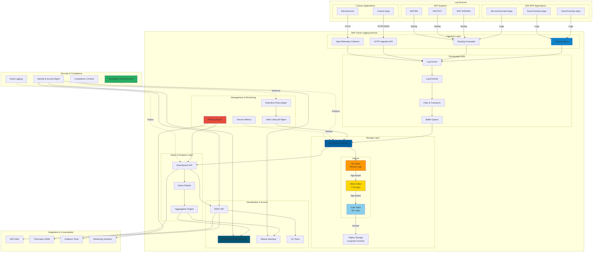

# Exercise 3 - Exploring Kyma Telemetry with SAP Cloud Logging

## Exercise 3.0 - Simulate some load

Lets make some HTTP requests to the Httpbin application previously deployed in the Kyma runtime.

- 👉 Open the Student Workflow (namespaced) from the table below. It will make 10 requests to the Httpbin application.  
- 👉 In order to simulate more load, edit the request count to for instance 100 (one hundred)  
- 👉 Once completed, navigate to SAP Cloud Logging to explore the three pillars of Kyma Telemetry: Logs, Metrics and Traces.  

> [!TIP]
> 👉 For the best experience, open workflow links into a separate tab or into a new window (right click).  

| Kyma BTP Region (Cockpit) |  Kyma dashboard | Admin Worklow (cluster-wide) | Student Workflow (namespaced)| Data Collection Workflow (namespaced)
 | :---------  | --------- | :--------- | :------- | -----------
 | [uk-south](https://url.sap/0dd8pm) |  | [uk-south--admin](../../../../actions/workflows/uk-south-teched-7a69075f-7faf-4604-a62e-806648791dba.yml) | [uk-south--xp264](../../../../actions/workflows/uk-south-teched-7a69075f-7faf-4604-a62e-806648791dba-xp264.yml)| [ k8s-data-context-student](../../../../actions/workflows/k8s-data-context-student.yml)
 | [japan-east](https://url.sap/u66itn) |  | [japan-east--admin](../../../../actions/workflows/japan-east-teched-2a6fe480-ac84-4751-ad37-56ec2a493932.yml) | [japan-east--xp264](../../../../actions/workflows/japan-east-teched-2a6fe480-ac84-4751-ad37-56ec2a493932-xp264.yml) | [k8s-data-context-student](../../../../actions/workflows/k8s-data-context-student.yml)
 | [us-east](https://url.sap/b24wtp) |  | [us-east--admin](../../../../actions/workflows/btp-runtime-teched-dbe7346b-88da-430a-8777-4f6aa3e22b5e.yml) | [us-east--xp264](../../../../actions/workflows/btp-runtime-teched-dbe7346b-88da-430a-8777-4f6aa3e22b5e-xp264.yml) | [k8s-data-context-student](../../../../actions/workflows/k8s-data-context-student.yml)
 | [xp264-000](https://url.sap/v2dn5g) |  | [xp264-000--admin](../../../../actions/workflows/xp264-000-teched-622af3fe-a2f5-4fdd-a05f-73e343aec2a5.yml) | [xp264-000--xp264](../../../../actions/workflows/xp264-000-teched-622af3fe-a2f5-4fdd-a05f-73e343aec2a5-xp264.yml) | [k8s-data-context-student](../../../../actions/workflows/k8s-data-context-student.yml)
 | [uk-xp264](https://url.sap/ovbfn6) |  | [uk-xp264--admin](../../../../actions/workflows/uk-xp264-teched-76f46b5b-d9ab-486f-8e4f-12e1163af943.yml) | [uk-xp264--xp264](../../../../actions/workflows/uk-xp264-teched-76f46b5b-d9ab-486f-8e4f-12e1163af943-xp264.yml) | [k8s-data-context-student](../../../../actions/workflows/k8s-data-context-student.yml)

## Exercise 3.1 - Access SAP Cloud Logging

- Access the SAP Cloud Logging from the Link provided behind the picture below and open it with a new tab or window

- Navigate to `Discover` to acess the logs (if prompted for a "tenant", select the `Global` tenant)

<table style="width: 100%; border-collapse: collapse; background-color: #f5f5f5;" border="1">
<tbody>
<tr style="height: 193px;">
<td style="width: 71.6%; height: 193px;">

<h1></h1>

</td>
</tr>
</tbody>
</table>

## Exercise 3.2 - Explore Logs  

- Lets explore the logs generated by the Httpbin application.
- Refine the search be introducing the following settings:
  - Index pattern: `log-otel-v1-*`
  - In search bar, enter your cluster name to get only logs from your cluster e.g. `japa-east-c-99567a9` and term `/headers` as we called this URI while simulating load.
  - Add filter for `serviceName` for your application.

<table style="width: 100%; border-collapse: collapse; background-color: #f5f5f5;" border="1">
<tbody>
<tr style="height: 193px;">
<td style="width: 71.6%; height: 193px;">

<h1></h1>

</td>
</tr>
</tbody>
</table>

- Open any one of the log entries to see the details.  

<table style="width: 100%; border-collapse: collapse; background-color: #f5f5f5;" border="1">
<tbody>
<tr style="height: 193px;">
<td style="width: 71.6%; height: 193px;">

<h1></h1>

</td>
</tr>
</tbody>
</table> 

- Feel free to explore further

## Exercise 3.3 - Explore Metrics  

There are some pre-defined dashboards available in SAP Cloud Logging. Let's explore some of them.

- Select `Dashboards` from the left menu

<table style="width: 100%; border-collapse: collapse; background-color: #f5f5f5;" border="1">
<tbody>
<tr style="height: 193px;">
<td style="width: 71.6%; height: 193px;">

<h1></h1>

</td>
</tr>
</tbody>
</table>
- Access the `Kyma Overview` dashboard

<table style="width: 100%; border-collapse: collapse; background-color: #f5f5f5;" border="1">
<tbody>
<tr style="height: 193px;">
<td style="width: 71.6%; height: 193px;">

<h1></h1>

</td>
</tr>
</tbody>
</table>

- Check the overview dashboard. Apply the filters as shown below to narrow down details to your cluster and application

<table style="width: 100%; border-collapse: collapse; background-color: #f5f5f5;" border="1">
<tbody>
<tr style="height: 193px;">
<td style="width: 71.6%; height: 193px;">

<h1></h1>

</td>
</tr>
</tbody>
</table>

<table style="width: 100%; border-collapse: collapse; background-color: #f5f5f5;" border="1">
<tbody>
<tr style="height: 193px;">
<td style="width: 71.6%; height: 193px;">

<h1></h1>

</td>
</tr>
</tbody>
</table>

- Similarly check `Four golden signals` and `usage` dashboards

  * four golden signals

<table style="width: 100%; border-collapse: collapse; background-color: #f5f5f5;" border="1">
<tbody>
<tr style="height: 193px;">
<td style="width: 71.6%; height: 193px;">

<h1></h1>

</td>
</tr>
</tbody>
</table>

  * usage

<table style="width: 100%; border-collapse: collapse; background-color: #f5f5f5;" border="1">
<tbody>
<tr style="height: 193px;">
<td style="width: 71.6%; height: 193px;">

<h1></h1>

</td>
</tr>
</tbody>
</table>

- Feel free to explore further

## Exercise 3.4 - Explore Traces

- Select `Traces` from the left menu

<table style="width: 100%; border-collapse: collapse; background-color: #f5f5f5;" border="1">
<tbody>
<tr style="height: 193px;">
<td style="width: 71.6%; height: 193px;">

<h1></h1>

</td>
</tr>
</tbody>
</table>   

- Select one of the traces to see the details

<table style="width: 100%; border-collapse: collapse; background-color: #f5f5f5;" border="1">
<tbody>
<tr style="height: 193px;">
<td style="width: 71.6%; height: 193px;">

<h1></h1>

</td>
</tr>
</tbody>
</table>   

- The Trace view shows the request flow from istio ingress gateway to the Httpbin application

<table style="width: 100%; border-collapse: collapse; background-color: #f5f5f5;" border="1">
<tbody>
<tr style="height: 193px;">
<td style="width: 71.6%; height: 193px;">

<h1></h1>

</td>
</tr>
</tbody>
</table>

> [!NOTE]
> Some Trace spans may be jumbled up

- Feel free to explore further

- SAP Cloud Logging architecture. 

## Next steps

Continue to - [Exercise 4 - Explore SAP BTP Connectivity Capabilities in Kyma](../ex4/README.md)
